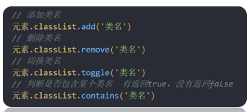

# 变量

在 JavaScript 中，可以使用 **var**、**let** 和 **const** 关键字来声明变量。

- **`var`**：ES5 引入的变量声明方式，具有函数作用域。
- **`let`**：ES6 引入的变量声明方式，具有块级作用域。
- **`const`**：ES6 引入的常量声明方式，具有块级作用域，且值不可变。

与代数一样，JavaScript 变量可用于存放值（比如 **x = 5**）和表达式（比如 **z = x + y**）。

变量可以使用短名称（比如 x 和 y），也可以使用描述性更好的名称（比如 age, sum, totalvolume）。

- 变量必须以字母开头
- 变量也能以`$`和`_`符号开头（不过我们不推荐这么做）
- 变量名称对大小写敏感（y 和 Y 是不同的变量）

### var

**var 声明特点：**

- 变量可以重复声明（覆盖原变量）。

- 变量未赋值时，默认值为 undefined。

- var 声明的变量会提升（Hoisting），但不会初始化。

  ```javascript
  var carname="Volvo"
  ```

您可以在一条语句中声明很多变量。该语句以 var 开头，并使用逗号分隔变量即可：

```javascript
var lastname="Doe", age=30, job="carpenter"
```

声明也可横跨多行：

```javascript
var lastname="Doe",
age=30,
job="carpenter";
```

### let

推荐使用`let`而不是`var`

```javascript
let city = "北京";
let age = 30;
console.log(city, age); // 输出: 北京 30


```

#### 块级作用域

```javascript
var x = 10;
// 这里输出 x 为 10
{ 
    let x = 2;
    // 这里输出 x 为 2
}
// 这里输出 x 为 10
```

#### 循环作用域

```javascript
var i = 5;
for (let i = 0; i < 10; i++) {
    // 一些代码...
}
// 这里输出 i 为 5
```

var可以重置变量，但let不行，相同作用域或块级作用域，不能重复定义一个变量

而且let不具有var的变量提升，必须先声明再使用

### const

const 用于定义常量，**声明时必须初始化**，即一旦赋值后，变量的值不能再被修改。

`const`定义常量与使用`let` 定义的变量相似：

- 二者都是块级作用域
- 都不能和它所在作用域内的其他变量或函数拥有相同的名称

两者还有以下两点区别：

- `const`声明的常量必须初始化，而`let`声明的变量不用
- const 定义常量的值不能通过再赋值修改，也不能再次声明。而 let 定义的变量值可以修改。

```javascript
const z = 10;
// z = 20; // 报错，常量不可重新赋值
if (true) {
    const z = 20; // 不同的常量
    console.log(z); // 输出 20
}
console.log(z); // 输出 10
```

const 的本质: const 定义的变量并非常量，并非不可变，它定义了一个常量引用一个值。使用 const 定义的对象或者数组，其实是可变的。只是不能重新赋值

# 函数

### 函数提升（hoisting）

提升（Hoisting）是 JavaScript 默认将当前作用域提升到前面去的行为。

提升（Hoisting）应用在变量的声明与函数的声明。

因此，函数可以在声明之前调用：

```javascript
myFunction(5);

function myFunction(y) {
    return y * y;
}

```

### 返回值

1. 在函数体中使用return 关键字能将内部的执行结果交给函数外部使用
2. 函数内部只能出现1 次 return，并且 return 下一行代码不会再被执行，所以return 后面的数据不要换行写
3. return会立即结束当前函数
4. 函数可以没有return，这种情况默认返回值为 undefined

### 自调用函数

如果表达式后面紧跟 () ，则会自动调用。

通过添加括号，来说明它是一个函数表达式：

```javascript
(function () {
    var x = "Hello!!";      // 我将调用自己
})();
```

第二种

```js
(function(){
    xxx
}())
```

### 函数表达式

```js
// 声明
let fn = function() { 
   console.log('函数表达式')
}
// 调用
fn()
```

### 函数是对象

JavaScript 函数有 **属性** 和 **方法**。

```js
function myFunction(a, b) {    
    return arguments.length;     // 返回收到的参数个数
}
```

toString() 方法将函数作为一个字符串返回:

```javascript
function myFunction(a, b) {    
    return a * b;
}
var txt = myFunction.toString();
```

### 箭头函数

箭头函数表达式的语法比普通函数表达式更简洁。

```javascript
// ES5
var x = function(x, y) {
     return x * y;
}
 
// ES6
const x = (x, y) => x * y;
```

### 默认参数

函数可以自带参数

```javascript
function myFunction(x, y = 10) {
    // y is 10 if not passed or undefined
    return x + y;
}
 
myFunction(0, 2) // 输出 2
myFunction(5); // 输出 15, y 参数的默认值
```

## arguments 对象

JavaScript 函数有个内置的对象 arguments 对象。

arguments 对象包含了函数调用的参数数组。

通过这种方式你可以很方便的找到最大的一个参数的值：

```javascript
var y = findMax(1, 123, 500, 115, 44, 88) 
function findMax() {
    var max = arguments[0]
    len = arguments.length

    if (len < 2) {
        return max
    }

    for (let i = 1; i < len; i++) {
        if(arguments[i] > max) {
            max = arguments[i]
        }
    }

    return max
}
document.getElementById("id5").innerHTML += y
```

### 函数调用

- 作为一个函数调用
- 作为方法调用（在对象中定义一个函数）
- 使用构造函数调用函数
- 作为函数方法

方法

```javascript
var myObject = {
    firstName:"John",
    lastName: "Doe",
    fullName: function () {
        return this.firstName + " " + this.lastName;
    }
}
myObject.fullName();         // 返回 "John Doe"
```

构造函数

```javascript
// 构造函数:
function myFunction(arg1, arg2) {
    this.firstName = arg1;
    this.lastName  = arg2;
}
 
// This    creates a new object
var x = new myFunction("John","Doe");
x.firstName;                             // 返回 "John"
```

函数方法

```javascript
function myFunction(a, b) {
    return a * b;
}
myObject = myFunction.call(myObject, 10, 2);     // 返回 20
```

# 对象

## 创建对象

```javascript
let obj = {} // 空对象
let obj = new Object()
let obj = Object create(null)
```

对象也是一个变量，但对象可以包含多个值（多个变量），每个值以 **name:value** 对呈现。

```javascript
var car = {name:"Fiat", model:500, color:"white"};
```

## 访问对象属性

你可以通过两种方式访问对象属性:

可以使用 `.` 或 `[]` 获得对象中属性对应的值

```javascript
var person = {
    firstName:"John",
    lastName:"Doe",
    age:50,
    eyeColor:"blue"
};
person.lastName;
person["lastName"];
```

可以动态为对象添加属性

```js
<!DOCTYPE html>
<html lang="en">
<head>
  <meta charset="UTF-8">
  <title>JavaScript 基础 - 对象语法</title>
</head>
<body>

  <script>
    // 声明一个空的对象（没有任何属性）
	let user = {}
    // 动态追加属性
    user.name = '小明'
    user['age'] = 18
    
    // 动态添加与直接定义是一样的，只是语法上更灵活
  </script>
</body>
</html>
```

也可以动态为对象添加方法

```js
<!DOCTYPE html>
<html lang="en">
<head>
  <meta charset="UTF-8">
  <title>JavaScript 基础 - 对象方法</title>
</head>
<body>

  <script>
    // 声明一个空的对象（没有任何属性，也没有任何方法）
	let user = {}
    // 动态追加属性
    user.name = '小明'
    user.['age'] = 18
    
    // 动态添加方法
    user.move = function () {
      console.log('移动一点距离...')
    }
    
  </script>
</body>
</html>
```

> 无论是属性或是方法，同一个对象中出现名称一样的，后面的会覆盖前面的

## null

null 也是 JavaScript 中数据类型的一种，通常只用它来表示不存在的对象。使用 typeof 检测类型它的类型时，结果为 `object`。

## 内置对象

回想一下我们曾经使用过的 `console.log`，`console`其实就是 JavaScript 中内置的对象，该对象中存在一个方法叫 `log`，然后调用 `log` 这个方法，即 `console.log()`。

除了 `console` 对象外，JavaScritp 还有其它的内置的对象

### Math

`Math` 是 JavaScript 中内置的对象，称为数学对象，这个对象下即包含了属性，也包含了许多的方法。例如`min,max,floor,ceil,round,abs,sqrt,pow`

## 拓展

让一个旧对象赋值给新对象， 修改新对象的值，会一起修改旧对象的值

```js
<!DOCTYPE html>
<html lang="en">
<head>
  <meta charset="UTF-8">
  <meta name="viewport" content="width=device-width, initial-scale=1.0">
  <title>Document</title>
</head>
<body>
  <script>
    let num1 = 10
    let num2 = num1
    num2 = 20
    console.log(num1);
    

    let obj1 = {
      age: 19
    }

    let obj2 = obj1
    obj2.age = 26
    // 会改变原来的值
    console.log(obj1.age);
    

  </script>
</body>
</html>
```


# 字符串

字符串可以是插入到引号中的任何字符。你可以使用单引号或双引号

字符串的索引从 0 开始，这意味着第一个字符索引值为 **[0]**，第二个为 **[1]**，以此类推。

你可以在字符串中使用引号，字符串中的引号不要与字符串的引号相同:

```javascript
var answer = "It's alright";
var answer = "He is called 'Johnny'";
var answer = 'He is called "Johnny"';
```

你也可以在字符串添加转义字符来使用引号：

```javascript
var x = 'It\'s alright';
var y = "He is called \"Johnny\"";
```

可以使用内置属性 **length** 来计算字符串的长度：

```javascript
var txt = "ABCDEFGHIJKLMNOPQRSTUVWXYZ";var sln = txt.length;
```

#### 转义字符

| 代码 | 输出        |
| :--- | :---------- |
| \\'  | 单引号      |
| \\"  | 双引号      |
| \\\  | 反斜杠      |
| \n   | 换行        |
| \r   | 回车        |
| \t   | tab(制表符) |
| \b   | 退格符      |
| \f   | 换页符      |

字符串也可以是对象

```javascript
var s2 = new String("hsh")
```

#### 字符串属性

| 属性        | 描述                       |
| :---------- | :------------------------- |
| constructor | 返回创建字符串属性的函数   |
| length      | 返回字符串的长度           |
| prototype   | 允许您向对象添加属性和方法 |

#### 方法函数

| 方法                | 描述                                                         |
| :------------------ | :----------------------------------------------------------- |
| charAt()            | 返回指定索引位置的字符                                       |
| charCodeAt()        | 返回指定索引位置字符的 Unicode 值                            |
| concat()            | 连接两个或多个字符串，返回连接后的字符串                     |
| fromCharCode()      | 将 Unicode 转换为字符串                                      |
| indexOf()           | 返回字符串中检索指定字符第一次出现的位置                     |
| lastIndexOf()       | 返回字符串中检索指定字符最后一次出现的位置                   |
| localeCompare()     | 用本地特定的顺序来比较两个字符串                             |
| match()             | 找到一个或多个正则表达式的匹配                               |
| replace()           | 替换与正则表达式匹配的子串                                   |
| search()            | 检索与正则表达式相匹配的值                                   |
| slice()             | 提取字符串的片断，并在新的字符串中返回被提取的部分           |
| split()             | 把字符串分割为子字符串数组                                   |
| substr()            | 从起始索引号提取字符串中指定数目的字符                       |
| substring()         | 提取字符串中两个指定的索引号之间的字符                       |
| toLocaleLowerCase() | 根据主机的语言环境把字符串转换为小写，只有几种语言（如土耳其语）具有地方特有的大小写映射 |
| toLocaleUpperCase() | 根据主机的语言环境把字符串转换为大写，只有几种语言（如土耳其语）具有地方特有的大小写映射 |
| toLowerCase()       | 把字符串转换为小写，返回一个新的字符串，**原字符串不变**     |
| toString()          | 返回字符串对象值                                             |
| toUpperCase()       | 把字符串转换为大写，返回一个新的字符串，**原字符串不变**     |
| trim()              | 移除字符串首尾空白                                           |
| valueOf()           | 返回某个字符串对象的原始值                                   |

# 模板字符串

JavaScript 中的模板字符串是一种方便的字符串语法，允许你在字符串中嵌入表达式和变量。

模板字符串使用反引号 **``** 作为字符串的定界符分隔的字面量。

模板字面量是用反引号（**`**）分隔的字面量，允许多行字符串、带嵌入表达式的字符串插值和一种叫带标签的模板的特殊结构。

模板字符串中可以同时使用单引号和双引号：

```javascript
let text = `He's often called "Runoob"`;
```

若要转义模板字面量中的反引号（**`**），需在反引号之前加一个反斜杠（**\\**）。

除了普通字符串外，模板字面量还可以包含占位符——一种由美元符号和大括号分隔的嵌入式表达式：**${expression}**。

```javascript
const name = 'Runoob';
const age = 30;
const message = `My name is ${name} and I'm ${age} years old.`;
```

模板字符串中允许我们使用表达式：

```javascript
let price = 10;
let VAT = 0.25;

let total = `Total: ${(price * (1 + VAT)).toFixed(2)}`;
```

# 运算符

`+` 运算符用于把文本值或字符串变量加起来（连接起来）。

```javascript
txt1="What a very";
txt2="nice day";
txt3=txt1+txt2;
//What a verynice day
```

两个数字相加，返回数字相加的和，**如果数字与字符串相加，返回字符串**，如下实例：

```javascript
x=5+5;
y="5"+5;
z="Hello"+5;
//10
//55
//Hello5
```

### 比较运算符

`===`绝对等于（值和类型都相等）

`!==`严格不等于运算符（值和类型有一个不相等，或两个都不相等）

### 逻辑运算符

| 运算符 | 描述 | 例子                          |
| :----- | :--- | :---------------------------- |
| &&     | and  | (x < 10 && y > 1) 为 true     |
| \|\|   | or   | (x == 5 \|\| y == 5) 为 false |
| !      | not  | !(x==y) 为 true               |

### 条件运算符

`variablename=(condition)?value1:value2 `

相当于`c++`中的三目运算符

```javascript
voteable=(age<18)?"年龄太小":"年龄已达到";
```

# typeof

**typeof** 是 JavaScript 中的一个操作符，用于返回给定变量的数据类型。

**完整类型检测表:**

| 表达式                | 返回值      | 说明                 |
| :-------------------- | :---------- | :------------------- |
| `typeof undefined`    | "undefined" | 未定义的值           |
| `typeof true`         | "boolean"   | 布尔值               |
| `typeof 42`           | "number"    | 所有数字类型         |
| `typeof "text"`       | "string"    | 字符串               |
| `typeof {a:1}`        | "object"    | 对象、数组、null     |
| `typeof function(){}` | "function"  | 函数                 |
| `typeof Symbol()`     | "symbol"    | ES6新增符号类型      |
| `typeof BigInt(10)`   | "bigint"    | ES2020新增大整数类型 |

检测未定义变量：

```javascript
if (typeof variable === "undefined") {...}
```

检测函数是否存在：

```javascript
if (typeof myFunction === "function") {...}
```

注意数组和null的特殊情况：

```javascript
// 正确检测数组
if (Array.isArray(myVar)) {...}

// 正确检测null
if (myVar === null) {...}
```

#### null

在 JavaScript 中 null 表示 "什么都没有"。

null是一个只有一个值的特殊类型。表示一个空对象引用。

> 用typeof检测null返回的是object

可以设置为`null`或`undefined`来清空对象

```javascript
var person = null;           // 值为 null(空), 但类型为对象
var person = undefined;     // 值为 undefined, 类型为 undefined
```

#### undefined

在 JavaScript 中, **undefined** 是一个没有设置值的变量。

**typeof** 一个没有值的变量会返回 **undefined**。

```javascript
var person;                  // 值为 undefined(空), 类型是undefined
```

null 和 undefined 的值相等，但类型不等：

```javascript
typeof undefined             // undefined
typeof null                  // object
null === undefined           // false
null == undefined            // true
```

# 类型转换

请注意：

- NaN 的数据类型是 number
- 数组(Array)的数据类型是 object
- 日期(Date)的数据类型为 object
- null 的数据类型是 object
- 未定义变量的数据类型为 undefined

如果对象是 JavaScript Array 或 JavaScript Date ，我们就无法通过 **typeof** 来判断他们的类型，因为都是 返回 object。

### construct属性

**constructor** 属性返回所有 JavaScript 变量的构造函数。

```javascript
"John".constructor                 // 返回函数 String()  { [native code] }
(3.14).constructor                 // 返回函数 Number()  { [native code] }
false.constructor                 // 返回函数 Boolean() { [native code] }
[1,2,3,4].constructor             // 返回函数 Array()   { [native code] }
{name:'John', age:34}.constructor // 返回函数 Object()  { [native code] }
new Date().constructor            // 返回函数 Date()    { [native code] }
function () {}.constructor        // 返回函数 Function(){ [native code] }
```

### 将数字转换为字符串

全局方法 **String()** 可以将数字转换为字符串。

该方法可用于任何类型的数字，字母，变量，表达式：

```javascript
String(x)         // 将变量 x 转换为字符串并返回
String(123)       // 将数字 123 转换为字符串并返回
String(100 + 23)  // 将数字表达式转换为字符串并返回
```

Number 方法 **toString()** 也是有同样的效果。

布尔值和日期同样如上式

### 将数字转换为数字

全局方法 **Number()** 可以将字符串转换为数字。

字符串包含数字(如 "3.14") 转换为数字 (如 3.14).

空字符串转换为 0。

其他的字符串会转换为 NaN (不是个数字)。

```javascript
Number("3.14")    // 返回 3.14
Number(" ")       // 返回 0 
Number("")        // 返回 0
Number("99 88")   // 返回 NaN
```

### 一元运算符+

**Operator +** 可用于将变量转换为数字：

```javascript
var y = "5";     // y 是一个字符串
var x = + y;     // x 是一个数字
```

如果变量不能转换，它仍然会是一个数字，但值为 NaN (不是一个数字):

```javascript
var y = "John";  // y 是一个字符串
var x = + y;     // x 是一个数字 (NaN)
```

### 将布尔值转换为数字

```javascript
Number(false)     // 返回 0
Number(true)      // 返回 1
```

字符串和别的类型相加会把别的类型转换为字符串

字符串和数字相减会转换为数字

```javascript
5 + null    // 返回 5         null 转换为 0
"5" + null  // 返回"5null"   null 转换为 "null"
"5" + 1     // 返回 "51"      1 转换为 "1"  
"5" - 1     // 返回 4         "5" 转换为 5
```

# 正则表达式

### 语法

```
/正则表达式主体/修饰符(可选)
```

`var patt = /runoob/i`

实例解析：

**/runoob/i** 是一个正则表达式。

**runoob** 是一个**正则表达式主体** (用于检索)。

**i** 是一个**修饰符** (搜索不区分大小写)。

`search`和`replace`函数使用正则表达式，可以是功能更强大（`i`不区分大小写）

```java
function change1() {
  var str = document.getElementById("demo7").innerHTML
  var txt = str.replace(/microsoft/i, "Runoob")

  document.getElementById("demo7").innerHTML = txt
}

function change2() {
  var str = document.getElementById("demo7").innerHTML
  var pos = str.search(/runoob/i)
  document.getElementById("demo7").innerHTML += "<br> runoob的位置在" + pos
}
```

### 正则表达式修饰符

**修饰符** 可以在全局搜索中不区分大小写:

| 修饰符 | 描述                                                     |
| :----- | :------------------------------------------------------- |
| i      | 执行对大小写不敏感的匹配。                               |
| g      | 执行全局匹配（查找所有匹配而非在找到第一个匹配后停止）。 |
| m      | 执行多行匹配。                                           |

判断输入字符串是否为数字、字母、下划线组成

```javascript
function isValid(str) {
  return /^\w+$/.test(str);
}
//function isValid(str) { return /^[A-Za-z0-9_]+$/.test(str); } 也可以这么写
```

### 1. `^\w+$` 是一个正则表达式（RegExp）：

- `^`：表示字符串的开始。
- `\w`：表示一个“单词字符”，等价于 `[A-Za-z0-9_]`（字母、数字、下划线）。
- `+`：表示“一个或多个”前面的字符。
- `$`：表示字符串的结束。

综合起来：`^\w+$` 表示 **整个字符串必须只由字母、数字或下划线组成，不能包含空格或特殊字符**。

### 2. `.test(str)` 是 RegExp 的方法：

- 用来测试字符串 `str` 是否符合这个正则表达式。
- 如果符合，返回 `true`，否则返回 `false`。

#### 常见的简写字符类

| 表达式 | 含义             | 等价于          | 说明                 |
| ------ | ---------------- | --------------- | -------------------- |
| `\w`   | 单词字符（word） | `[A-Za-z0-9_]`  | 字母、数字、下划线   |
| `\W`   | 非单词字符       | `[^A-Za-z0-9_]` | 和 `\w` 相反         |
| `\d`   | 数字字符         | `[0-9]`         | 任意一个数字         |
| `\D`   | 非数字字符       | `[^0-9]`        | 非数字               |
| `\s`   | 空白字符         | `[ \t\r\n\f]`   | 空格、制表符、换行等 |
| `\S`   | 非空白字符       | `[^ \t\r\n\f]`  | 非空格类字符         |

#### 定位符

| 表达式 | 含义                             |
| ------ | -------------------------------- |
| `^`    | 匹配字符串开头                   |
| `$`    | 匹配字符串结尾                   |
| `\b`   | 匹配单词边界（例如空格、标点等） |
| `\B`   | 非单词边界                       |

#### 常用元字符

| 字符    | 含义                                         |
| ------- | -------------------------------------------- |
| `.`     | 匹配除换行符以外的任意单个字符               |
| `*`     | 重复0次或多次                                |
| `+`     | 重复1次或多次                                |
| `?`     | 重复0次或1次，或者表示非贪婪匹配（视上下文） |
| `{n}`   | 恰好n次                                      |
| `{n,}`  | 至少n次                                      |
| `{n,m}` | n到m次                                       |
| `[]`    | 字符集，匹配其中任意一个字符                 |
| `[^]`   | 否定字符集，匹配不在其中的任意字符           |
| `()`    | 分组                                         |
| `       | `                                            |

###  举几个例子：

1. 只匹配邮箱名部分（英文字母、数字、点、下划线）：

   ```javascript
   /^[\w.]+$/
   ```

2. 匹配 4 位数字：

   ```javascript
   /^\d{4}$/
   ```

3. 匹配中文字符（使用 Unicode 范围）：

   ```javascript
   /^[\u4e00-\u9fa5]+$/
   ```

4. 匹配字母开头的用户名（6~12位）：

   ```javascript
   /^[A-Za-z][A-Za-z0-9_]{5,11}$/
   ```

# try catch finally

**try** 语句允许我们定义在执行时进行错误测试的代码块。

**catch** 语句允许我们定义当 try 代码块发生错误时，所执行的代码块。

JavaScript 语句 **try** 和 **catch** 是成对出现的。

### finally 语句

finally 语句不论之前的 try 和 catch 中是否产生异常都会执行该代码块。

#### Throw语句

throw 语句允许我们创建自定义错误。

正确的技术术语是：创建或**抛出异常**（exception）。

如果把 throw 与 try 和 catch 一起使用，那么您能够控制程序流，并生成自定义的错误消息。

```
throw exception
```

异常可以是 JavaScript 字符串、数字、逻辑值或对象。

```javascript
try {
    ...    //异常的抛出
} catch(e) {
    ...    //异常的捕获与处理
} finally {
    ...    //结束处理
}
```


```javascript
function fun1() {
  var message, x;
  message = document.getElementById("demo8")
  message.innerHTML = ""
  x = document.getElementById("ex3").value
  try {
    if (x == "") {
      throw "值是空"
    } 
    if (isNaN(x)) {
      throw "值不是一个数字"
    }
    x = Number(x)
    if (x > 10) {
      throw "too big"
    }
    if (x < 5) {
      throw "to small"
    }
  }
  catch(err) {
    message.innerHTML = "error: " + err + "."
  }
  finally {
    document.getElementById("ex3").value = ""
  }
```

# 验证API

```javascript
<input id="id1" type="number" min="100" max="300" required>
<button onclick="myFunction()">验证</button>
 
<p id="demo"></p>
 
<script>function myFunction() {
    var inpObj = document.getElementById("id1");
    if (inpObj.checkValidity() == false) {
        document.getElementById("demo").innerHTML = inpObj.validationMessage;
    }
}</script>
```

### 约束验证DOM方法

| 属性                | 说明                                                   |
| ------------------- | ------------------------------------------------------ |
| `checkValidity()`   | 方法，检查元素是否通过了所有内置验证规则，返回布尔值   |
| `validationMessage` | 属性，返回一条字符串消息，表示为何输入不合法（如果有） |

## 约束验证 DOM 属性

| 属性              | 描述                                  |
| :---------------- | :------------------------------------ |
| validity          | 布尔属性值，返回 input 输入值是否合法 |
| validationMessage | 浏览器错误提示信息                    |
| willValidate      | 指定 input 是否需要验证               |

## Validity 属性

input 元素的 **validity 属性**包含一系列关于 validity 数据属性:

| 属性            | 描述                                                       |
| :-------------- | :--------------------------------------------------------- |
| customError     | 设置为 true, 如果设置了自定义的 validity 信息。            |
| patternMismatch | 设置为 true, 如果元素的值不匹配它的模式属性。              |
| rangeOverflow   | 设置为 true, 如果元素的值大于设置的最大值。                |
| rangeUnderflow  | 设置为 true, 如果元素的值小于它的最小值。                  |
| stepMismatch    | 设置为 true, 如果元素的值不是按照规定的 step 属性设置。    |
| tooLong         | 设置为 true, 如果元素的值超过了 maxLength 属性设置的长度。 |
| typeMismatch    | 设置为 true, 如果元素的值不是预期相匹配的类型。            |
| valueMissing    | 设置为 true，如果元素 (required 属性) 没有值。             |
| valid           | 设置为 true，如果元素的值是合法的。                        |


# 类（class）

每个类中包含了一个特殊的方法 **constructor()**，它是类的构造函数，这种方法用于创建和初始化一个由 **class** 创建的对象。

```javascript
class runoob {
    construct(name, url) {
        this.name = name
        this.url = url
    }
}
let site = new runoob("菜鸟教程", "www.runoob.com")
document.getElementById("demo").innerHTML = site.name + ":" + site.url
```

创建对象时会自动调用构造函数方法 **constructor()**。

### 构造方法

构造方法是一种特殊的方法：

- 构造方法名为 constructor()。
- 构造方法在创建新对象时会自动执行。
- 构造方法用于初始化对象属性。
- 如果不定义构造方法，JavaScript 会自动添加一个空的构造方法。

# 类继承

JavaScript 类继承使用`extends` 关键字。

继承允许我们依据另一个类来定义一个类，这使得创建和维护一个应用程序变得更容易。

**`super()`** 方法用于调用父类的构造函数。

#### 语法

```javascript
// 基类
class Animal {
    // eat() 函数
    // sleep() 函数
};
 
 
//派生类
class Dog extends Animal {
    // bark() 函数
};
```

#### 例子

```javascript
class Site {
  constructor(name) {
    this.sitename = name;
  }
  present() {
    return '我喜欢' + this.sitename;
  }
}
 
class Runoob extends Site {
  constructor(name, age) {
    super(name);
    this.age = age;
  }
  show() {
    return this.present() + ', 它创建了 ' + this.age + ' 年。';
  }
}
 
let noob = new Runoob("菜鸟教程", 5);
document.getElementById("demo").innerHTML = noob.show();
```

# 静态方法

静态方法是使用 static 关键字修饰的方法，又叫类方法，属于类的，但不属于对象，在实例化对象之前可以通过 **类名.方法名** 调用静态方法。

静态方法不能在对象上调用，只能在类中调用。

#### 例子

```javascript
class Runoob {
  constructor(name) {
    this.name = name;
  }
  static hello() {
    return "Hello!!";
  }
}
 
let noob = new Runoob("菜鸟教程");
 
// 可以在类中调用 'hello()' 方法
document.getElementById("demo").innerHTML = Runoob.hello();
 
// 不能通过实例化后的对象调用静态方法
// document.getElementById("demo").innerHTML = noob.hello();
// 以上代码会报错
```


# notice

如果` <script src="index.js"></script>`放在前面可能导致先运行js文件而导致HTML元素已经加载完了

保留关键字

# HTML载入外部JavaScript文件

使用简洁的格式载入 JavaScript 文件 ( type 属性不是必须的):

```javascript
<script src="myscript.js">
```

# 使用JavaScript访问HTML元素

```javascript
document.getElementById("demo")
```

# HTML DOM

### 查找 HTML 元素

通常，通过 JavaScript，您需要操作 HTML 元素。

为了做到这件事情，您必须首先找到该元素。有三种方法来做这件事：

- 通过 id 找到 HTML 元素
- 通过标签名找到 HTML 元素
- 通过类名找到 HTML 元素

### 通过 id 查找 HTML 元素

在 DOM 中查找 HTML 元素的最简单的方法，是通过使用元素的 id。

本例查找 id="intro" 元素：

```javascript
var x=document.getElementById("intro");
```

如果找到该元素，则该方法将以对象（在 x 中）的形式返回该元素。

如果未找到该元素，则 x 将包含 null。

### 通过标签名查找 HTML 元素

本例查找 id="main" 的元素，然后查找 id="main" 元素中的所有 <p> 元素：

```javascript
<p>你好世界!</p>
<div id="main">
<p> DOM 是非常有用的。</p>
<p>该实例展示了  <b>getElementsByTagName</b> 方法</p>
</div>
<script>
var x=document.getElementById("main");
var y=x.getElementsByTagName("p");
document.write('id="main"元素中的第一个段落为：' + y[0].innerHTML);
</script>
```

### 通过类名找到HTML元素

```javascript
var x=document.getElementsByClassName("intro");
```

# APIs

## document

`document`是js内置的专门用于DOM对象


## 获取dom元素方法


# transition

## transition-delay

CSS 的**transition-delay**属性规定了在[过渡效果](https://developer.mozilla.org/zh-CN/docs/Web/CSS/CSS_transitions/Using_CSS_transitions)开始作用之前需要等待的时间。

# js基础

## 引入方式

### 内部方式

通过 `script` 标签包裹 JavaScript 代码

### 外部方式

一般将 JavaScript 代码写在独立的以 .js 结尾的文件中，然后通过 `script` 标签的 `src` 属性引入

如果 script 标签使用 src 属性引入了某 .js 文件，那么 标签的代码会被忽略！！！如下代码所示：

```js
<!DOCTYPE html>
<html lang="en">
<head>
  <meta charset="UTF-8">
  <title>JavaScript 基础 - 引入方式</title>
</head>
<body>
  <!-- 外部形式：通过 script 的 src 属性引入独立的 .js 文件 -->
  <script src="demo.js">
    // 此处的代码会被忽略掉！！！！
  	alert(666);  
  </script>
</body>
</html>
```

## 隐式转换

```js
<!DOCTYPE html>
<html lang="en">
<head>
  <meta charset="UTF-8">
  <title>JavaScript 基础 - 隐式转换</title>
</head>
<body>
  <script> 
    let num = 13 // 数值
    let num2 = '2' // 字符串

    // 结果为 132
    // 原因是将数值 num 转换成了字符串，相当于 '13'
    // 然后 + 将两个字符串拼接到了一起
    console.log(num + num2)

    // 结果为 11
    // 原因是将字符串 num2 转换成了数值，相当于 2
    // 然后数值 13 减去 数值 2
    console.log(num - num2)

    let a = prompt('请输入一个数字')
    let b = prompt('请再输入一个数字')

    alert(a + b);
  </script>
</body>
</html>
```

## 显示转换

### Number

通过 `Number` 显示转换成数值类型，当转换失败时结果为 `NaN`（Not a Number）即不是一个数字。

```js
<!DOCTYPE html>
<html lang="en">
<head>
  <meta charset="UTF-8">
  <title>JavaScript 基础 - 隐式转换</title>
</head>
<body>
  <script>
    let t = '12'
    let f = 8

    // 显式将字符串 12 转换成数值 12
    t = Number(t)

    // 检测转换后的类型
    // console.log(typeof t);
    console.log(t + f) // 结果为 20

    // 并不是所有的值都可以被转成数值类型
    let str = 'hello'
    // 将 hello 转成数值是不现实的，当无法转换成
    // 数值时，得到的结果为 NaN （Not a Number）
    console.log(Number(str))
  </script>
</body>
</html>
```

## 比较运算符

| 运算符 | 作用                                   |
| ------ | -------------------------------------- |
| >      | 左边是否大于右边                       |
| <      | 左边是否小于右边                       |
| >=     | 左边是否大于或等于右边                 |
| <=     | 左边是否小于或等于右边                 |
| ===    | 左右两边是否`类型`和`值`都相等（重点） |
| ==     | 左右两边`值`是否相等                   |
| !=     | 左右值不相等                           |
| !==    | 左右两边是否不全等                     |

```js
<script>
  console.log(3 > 5)
  console.log(3 >= 3)
  console.log(2 == 2)
  // 比较运算符有隐式转换 把'2' 转换为 2  双等号 只判断值
  console.log(2 == '2')  // true
  // console.log(undefined === null)
  // === 全等 判断 值 和 数据类型都一样才行
  // 以后判断是否相等 请用 ===  
  console.log(2 === '2')
  console.log(NaN === NaN) // NaN 不等于任何人，包括他自己
  console.log(2 !== '2')  // true  
  console.log(2 != '2') // false 
  console.log('-------------------------')
  console.log('a' < 'b') // true
  console.log('aa' < 'ab') // true
  console.log('aa' < 'aac') // true
  console.log('-------------------------')
</script>
```

## 数组

### 数据单元值类型

数组做为数据的集合，它的单元值可以是任意数据类型

```js
<script>
  // 6. 数组单值类型可以是任意数据类型

  // a) 数组单元值的类型为字符类型
  let list = ['HTML', 'CSS', 'JavaScript']
  // b) 数组单元值的类型为数值类型
  let scores = [78, 84, 70, 62, 75]
  // c) 混合多种类型
  let mixin = [true, 1, false, 'hello']
</script>
```

获取数组的长度用`arr.length`

### 操作数组

1. `push`动态向数组的尾部添加一个单元
2. `unshift`动态向数组头部添加一个单元
3. `pop`删除最后一个单元
4. `shift`删除第一个单元
5. `splice`动态删除任意单元   `splice(起始位置， 删除个数)`

#### 添加元素

splice(起始位置，删除个数，添加数组元素)

```js
let arr = ['red', 'green', 'blue']
//arr.splice(1, 0, 'pink') // 在索引号是1的位置添加 pink
//console.log(arr) // ['red', 'pink', 'green', 'blue']
arr.splice(1, 0, 'pink', 'hotpink') // 在索引号是1的位置添加 pink  hotpink
console.log(arr) // ['red', 'pink', 'hotpink', 'green', 'blue']
```

```js
<script>
  // 定义一个数组
  let arr = ['html', 'css', 'javascript']

  // 1. push 动态向数组的尾部添加一个单元
  arr.push('Nodejs')
  console.log(arr)
  arr.push('Vue')

  // 2. unshit 动态向数组头部添加一个单元
  arr.unshift('VS Code')
  console.log(arr)

  // 3. splice 动态删除任意单元
  arr.splice(2, 1) // 从索引值为2的位置开始删除1个单元
  console.log(arr)

  // 4. pop 删除最后一个单元
  arr.pop()
  console.log(arr)

  // 5. shift 删除第一个单元
  arr.shift()
  console.log(arr)
</script>
```

## 函数

### 调用

声明（定义）的函数必须调用才会真正被执行，使用 `()` 调用函数。

### 函数表达式

```js
// 声明
let fn = function() { 
   console.log('函数表达式')
}
// 调用
fn()
```

### 立即执行函数

无需调用立即执行，多个立即执行函数需要用分号隔开

```js
(function(){ xxx  })();
(function(){xxxx}());
```

## 对象

用`{}`创建对象

### 属性和访问

1. 多个属性之间用英文`,`隔开
2. 属性都是成对出现的，包括属性名和值，他们之间用英文`:`分隔

声明对象，并添加了若干属性后，可以使用 `.` 或 `[]` 获得对象中属性对应的值，我称之为属性访问。

```js
<!DOCTYPE html>
<html lang="en">
<head>
  <meta charset="UTF-8">
  <title>JavaScript 基础 - 对象语法</title>
</head>
<body>

  <script>
    // 通过对象描述一个人的数据信息
    // person 是一个对象，它包含了一个属性 name
    // 属性都是成对出现的，属性名 和 值，它们之间使用英文 : 分隔
    let person = {
      name: '小明', // 描述人的姓名
      age: 18, // 描述人的年龄
      stature: 185, // 描述人的身高
      gender: '男', // 描述人的性别
    };
    
    // 访问人的名字
    console.log(person.name) // 结果为 小明
    // 访问人性别
    console.log(person.gender) // 结果为 男
    // 访问人的身高
    console.log(person['stature']) // 结果为 185
   // 或者
    console.log(person.stature) // 结果同为 185
  </script>
</body>
</html>
```

也可以动态添加

```js
<!DOCTYPE html>
<html lang="en">
<head>
  <meta charset="UTF-8">
  <title>JavaScript 基础 - 对象语法</title>
</head>
<body>

  <script>
    // 声明一个空的对象（没有任何属性）
	let user = {}
    // 动态追加属性
    user.name = '小明'
    user['age'] = 18
    
    // 动态添加与直接定义是一样的，只是语法上更灵活
  </script>
</body>
</html>
```

### 方法

声明对象，并添加了若干方法后，可以使用 `.` 或 `[]` 调用对象中函数，我称之为方法调用。

```js
<!DOCTYPE html>
<html lang="en">
<head>
  <meta charset="UTF-8">
  <title>JavaScript 基础 - 对象方法</title>
</head>
<body>

  <script>
    // 方法是依附在对象上的函数
    let person = {
      name: '小红',
      age: 18,
      // 方法是由方法名和函数两部分构成，它们之间使用 : 分隔
      singing: function () {
        console.log('两只老虎，两只老虎，跑的快，跑的快...')
      },
      run: function () {
        console.log('我跑的非常快...')
      }
    }
    
    // 调用对象中 singing 方法
    person.singing()
    // 调用对象中的 run 方法
    person.run()

  </script>
</body>
</html>
```

也可以动态添加

```js
  <script>
    // 声明一个空的对象（没有任何属性，也没有任何方法）
	let user = {}
    // 动态追加属性
    user.name = '小明'
    user.['age'] = 18
    
    // 动态添加方法
    user.move = function () {
      console.log('移动一点距离...')
    }
    
  </script>
```

> 无论是属性和方法，同一个对象出现名称一样的，后面的会覆盖前面的

### 遍历对象

```js
let obj = {
    uname: 'pink'
}
for(let k in obj) {
    // k 属性名  字符串  带引号    obj.'uname'     k ===  'uname'
    // obj[k]  属性值    obj['uname']   obj[k]
}
```

## 内置对象

回想一下我们曾经使用过的 `console.log`，`console`其实就是 JavaScript 中内置的对象，该对象中存在一个方法叫 `log`，然后调用 `log` 这个方法，即 `console.log()`。

还有像`Math`

属性有`Math.PI`圆周率

方法

1. `Math.random`
2. `Math.ceil`
3. `Math.floor`
4. `Math.round`
5. `Math.sqrt`

还有很多

# Web APIs

# DOM

### DOM节点

节点是文档树的组成部分，**每一个节点都是一个 DOM 对象**，主要分为元素节点、属性节点、文本节点等。

1. 【元素节点】其实就是 HTML 标签，如上图中 `head`、`div`、`body` 等都属于元素节点。
2. 【属性节点】是指 HTML 标签中的属性，如上图中 `a` 标签的 `href` 属性、`div` 标签的 `class` 属性。
3. 【文本节点】是指 HTML 标签的文字内容，如 `title` 标签中的文字。
4. 【根节点】特指 `html` 标签。
5. 其它...

#### document

`document` 是 JavaScript 内置的专门用于 DOM 的对象，该对象包含了若干的属性和方法，`document` 是学习 DOM 的核心。

```js
<script>
  // document 是内置的对象
  // console.log(typeof document);

  // 1. 通过 document 获取根节点
  console.log(document.documentElement); // 对应 html 标签

  // 2. 通过 document 节取 body 节点
  console.log(document.body); // 对应 body 标签

  // 3. 通过 document.write 方法向网页输出内容
  document.write('Hello World!');
</script>
```

### 获取DOM对象

1. `querySelect`满足条件的第一个元素
2. querySelectorAll满足条件的元素集合  返回**伪数组**
3. 其他方式`getElementById`和`getElementTagName`

```js
<!DOCTYPE html>
<html lang="en">
<head>
  <meta charset="UTF-8">
  <meta name="viewport" content="width=device-width, initial-scale=1.0">
  <title>DOM - 查找节点</title>
</head>
<body>
  <h3>查找元素类型节点</h3>
  <p>从整个 DOM 树中查找 DOM 节点是学习 DOM 的第一个步骤。</p>
  <ul>
      <li>元素</li>
      <li>元素</li>
      <li>元素</li>
      <li>元素</li>
  </ul>
  <script>
  	const p = document.querySelector('p')  // 获取第一个p元素
  	const lis = document.querySelectorAll('li')  // 获取第一个p元素
  </script>
</body>
</html>
```

总结：

- document.getElementById 专门获取元素类型节点，根据标签的 `id`  属性查找
- 任意 DOM 对象都包含 nodeType 属性，用来检检测节点类型

## 操作元素内容

通过修改 DOM 的文本内容，动态改变网页的内容。

1. `innerText` 将文本内容添加/更新到任意标签位置，**文本中包含的标签不会被解析。**

```html
<script>
  // innerText 将文本内容添加/更新到任意标签位置
  const intro = document.querySelector('.intro')
  // intro.innerText = '嗨~ 我叫李雷！'
  // intro.innerText = '<h4>嗨~ 我叫李雷！</h4>'
</script>
```

2. `innerHTML` 将文本内容添加/更新到任意标签位置，**文本中包含的标签会被解析。**

```html
<script>
  // innerHTML 将文本内容添加/更新到任意标签位置
  const intro = document.querySelector('.intro')
  intro.innerHTML = '嗨~ 我叫韩梅梅！'
  intro.innerHTML = '<h4>嗨~ 我叫韩梅梅！</h4>'
</script>
```

总结：如果文本内容中包含 `html` 标签时推荐使用 `innerHTML`，否则建议使用 `innerText` 属性。

### 常用属性修改

直接通过属性名修改，最简洁

```js
<script>
  // 1. 获取 img 对应的 DOM 元素
  const pic = document.querySelector('.pic')
	// 2. 修改属性
  pic.src = './images/lion.webp'
  pic.width = 400;
  pic.alt = '图片不见了...'
</script>
```

### 控制样式属性

1.应用【修改样式】，通过修改行内样式 `style` 属性，实现对样式的动态修改。

通过元素节点获得的 `style` 属性本身的数据类型也是对象，如 `box.style.color`、`box.style.width` 分别用来获取元素节点 CSS 样式的 `color` 和 `width` 的值。

```js
<!DOCTYPE html>
<html lang="en">
<head>
  <meta charset="UTF-8">
  <meta name="viewport" content="width=device-width, initial-scale=1.0">
  <title>练习 - 修改样式</title>
</head>
<body>
  <div class="box">随便一些文本内容</div>
  <script>
    // 获取 DOM 节点
    const box = document.querySelector('.intro')
    box.style.color = 'red'
    box.style.width = '300px'
    // css 属性的 - 连接符与 JavaScript 的 减运算符
    // 冲突，所以要改成驼峰法
    box.style.backgroundColor = 'pink'
  </script>
</body>
</html>
```

任何标签都有 `style` 属性，通过 `style` 属性可以动态更改网页标签的样式，如要遇到 `css` 属性中包含字符 `-` 时，要将 `-` 去掉并将其后面的字母改成大写，如 `background-color` 要写成 `box.style.backgroundColor`

2.操作类名`className`操作`CSS`

如果修改的样式比较多，直接通过style属性修改比较繁琐，我们可以通过借助于css类名的形式。

```js
<!DOCTYPE html>
<html lang="en">
<head>
  <meta charset="UTF-8">
  <meta name="viewport" content="width=device-width, initial-scale=1.0">
  <title>练习 - 修改样式</title>
    <style>
        .pink {
            background: pink;
            color: hotpink;
        }
    </style>
</head>
<body>
  <div class="box">随便一些文本内容</div>
  <script>
    // 获取 DOM 节点
    const box = document.querySelector('.intro')
    box.className = 'pink'
  </script>
</body>
</html>
```

> className是使用新值换旧值, 如果需要添加一个类,需要保留之前的类名

3.通过`classLst`操作类控制`CSS`

为了解决`className`容易覆盖以前的类名，我们可以通过`classList`方式追加和删除类名

```js

<!DOCTYPE html>
<html lang="en">

<head>
    <meta charset="UTF-8">
    <meta http-equiv="X-UA-Compatible" content="IE=edge">
    <meta name="viewport" content="width=device-width, initial-scale=1.0">
    <title>Document</title>
    <style>
        div {
            width: 200px;
            height: 200px;
            background-color: pink;
        }

        .active {
            width: 300px;
            height: 300px;
            background-color: hotpink;
            margin-left: 100px;
        }
    </style>
</head>

<body>

    <div class="one"></div>
    <script>
        // 1.获取元素
        // let box = document.querySelector('css选择器')
        let box = document.querySelector('div')
        // add是个方法 添加  追加
        // box.classList.add('active')
        // remove() 移除 类
        // box.classList.remove('one')
        // 切换类
        box.classList.toggle('one')
    </script>
</body>

</html>
```

### 操作表单元素属性

表单很多情况，也需要修改属性，比如点击眼睛，可以看到密码，本质是把表单类型转换为文本框

正常的有属性有取值的跟其他的标签属性没有任何区别

获取:DOM对象.属性名

设置:DOM对象.属性名= 新值

~~~html
<!DOCTYPE html>
<html lang="en">

<head>
    <meta charset="UTF-8">
    <meta http-equiv="X-UA-Compatible" content="IE=edge">
    <meta name="viewport" content="width=device-width, initial-scale=1.0">
    <title>Document</title>

</head>

<body>
    <input type="text" value="请输入">
    <button disabled>按钮</button>
    <input type="checkbox" name="" id="" class="agree">
    <script>
        // 1. 获取元素
        let input = document.querySelector('input')
        // 2. 取值或者设置值  得到input里面的值可以用 value
        // console.log(input.value)
        input.value = '小米手机'
        input.type = 'password'

        // 2. 启用按钮
        let btn = document.querySelector('button')
        // disabled 不可用   =  false  这样可以让按钮启用
        btn.disabled = false
        // 3. 勾选复选框
        let checkbox = document.querySelector('.agree')
        checkbox.checked = false
    </script>
</body>

</html>
~~~

### 自定义属性

标准属性: 标签天生自带的属性 比如class id title等, 可以直接使用点语法操作比如： disabled、checked、selected

自定义属性：

在html5中推出来了专门的data-自定义属性  

在标签上一律以data-开头

在DOM对象上一律以dataset对象方式获取

```js
<!DOCTYPE html>
<html lang="en">

<head>
    <meta charset="UTF-8">
    <meta http-equiv="X-UA-Compatible" content="IE=edge">
    <meta name="viewport" content="width=device-width, initial-scale=1.0">
    <title>Document</title>

</head>

<body>
   <div data-id="1"> 自定义属性 </div>
    <script>
        // 1. 获取元素
        let div = document.querySelector('div')
        // 2. 获取自定义属性值
         console.log(div.dataset.id)
      
    </script>
</body>

</html>
```

## 间歇函数

`setInterval` 是 JavaScript 中内置的函数，它的作用是间隔固定的时间自动重复执行另一个函数，也叫定时器函数。

```js
<script>
  // 1. 定义一个普通函数
  function repeat() {
    console.log('不知疲倦的执行下去....')
  }

  // 2. 使用 setInterval 调用 repeat 函数
  // 间隔 1000 毫秒，重复调用 repeat
  setInterval(repeat, 1000)
</script>
```

## 事件监听

结合 DOM 使用事件时，需要为 DOM 对象添加事件监听，等待事件发生（触发）时，便立即调用一个函数。

`addEventListener` 是 DOM 对象专门用来添加事件监听的方法，它的两个参数分别为【事件类型】和【事件回调】。

```js
<!DOCTYPE html>
<html lang="en">
<head>
  <meta charset="UTF-8">
  <meta name="viewport" content="width=device-width, initial-scale=1.0">
  <title>事件监听</title>
</head>
<body>
  <h3>事件监听</h3>
  <p id="text">为 DOM 元素添加事件监听，等待事件发生，便立即执行一个函数。</p>
  <button id="btn">点击改变文字颜色</button>
  <script>
    // 1. 获取 button 对应的 DOM 对象
    const btn = document.querySelector('#btn')

    // 2. 添加事件监听
    btn.addEventListener('click', function () {
      console.log('等待事件被触发...')
      // 改变 p 标签的文字颜色
      let text = document.getElementById('text')
      text.style.color = 'red'
    })

    // 3. 只要用户点击了按钮，事件便触发了！！！
  </script>
</body>
</html>
```

完成事件监听分成3个步骤：

1. 获取 DOM 元素
2. 通过 `addEventListener` 方法为 DOM 节点添加事件监听
3. 等待事件触发，如用户点击了某个按钮时便会触发 `click` 事件类型
4. 事件触发后，相对应的回调函数会被执行

## 事件类型

### 鼠标事件

`mouseenter`监听鼠标是否移入 DOM 元素

`mouseleave`监听鼠标是否移出 DOM 元素

### 键盘事件

`keydown`键盘按下触发

`keyup`键盘抬起触发

### 焦点事件

`focus`获得焦点

`blur`失去焦点

## 事件对象

任意事件类型被触发时与事件相关的信息会被以对象的形式记录下来，我们称这个对象为事件对象。

```html
<body>
  <h3>事件对象</h3>
  <p>任意事件类型被触发时与事件相关的信息会被以对象的形式记录下来，我们称这个对象为事件对象。</p>
  <hr>
  <div class="box"></div>
  <script>
    // 获取 .box 元素
    const box = document.querySelector('.box')

    // 添加事件监听
    box.addEventListener('click', function (e) {
      console.log('任意事件类型被触发后，相关信息会以对象形式被记录下来...');

      // 事件回调函数的第1个参数即所谓的事件对象
      console.log(e)
    })
  </script>
</body>
```

事件回调函数的【第1个参数】即所谓的事件对象，通常习惯性的将这个对数命名为 `event`、`ev` 、`ev` 。

1. `event.type`当前事件类型，例如`click, keydown, submit`
2. `event.clientX/Y`光标相对浏览器窗口的位置
3. `event.offsetX/Y`光标相对于当前`DOM`元素的位置
4. `event.target`触发事件的**原始元素**
5. `preventDufault`阻止事件的默认行为
6. `stopPropagation`阻止事件**冒泡**

## 环境对象

环境对象指的是函数内部特殊的变量 `this` ，它代表着当前函数运行时所处的环境。

```html
<script>
  // 声明函数
  function sayHi() {
    // this 是一个变量
    console.log(this);
  }

  // 声明一个对象
  let user = {
    name: '张三',
    sayHi: sayHi // 此处把 sayHi 函数，赋值给 sayHi 属性
  }
  
  let person = {
    name: '李四',
    sayHi: sayHi
  }

  // 直接调用
  sayHi() // window
  window.sayHi() // window

  // 做为对象方法调用
  user.sayHi()// user
	person.sayHi()// person
</script>
```

结论：

1. `this` 本质上是一个变量，数据类型为对象
2. 函数的调用方式不同 `this` 变量的值也不同
3. 【谁调用 `this` 就是谁】是判断 `this` 值的粗略规则
4. 函数直接调用时实际上 `window.sayHi()` 所以 `this` 的值为 `window`

## 回调函数

如果将函数 A 做为参数传递给函数 B 时，我们称函数 A 为回调函数。

```html
<script>
  // 声明 foo 函数
  function foo(arg) {
    console.log(arg);
  }

  // 普通的值做为参数
  foo(10);
  foo('hello world!');
  foo(['html', 'css', 'javascript']);

  function bar() {
    console.log('函数也能当参数...');
  }
  // 函数也可以做为参数！！！！
  foo(bar);
</script>
```

函数 `bar` 做参数传给了 `foo` 函数，`bar` 就是所谓的回调函数了！！！

我们回顾一下间歇函数 `setInterval` 

```html
<script>
	function fn() {
    console.log('我是回调函数...');
  }
  // 调用定时器
  setInterval(fn, 1000);
</script>
```

`fn` 函数做为参数传给了 `setInterval` ，这便是回调函数的实际应用了，结合刚刚学习的函数表达式上述代码还有另一种更常见写法。

```html
<script>
  // 调用定时器，匿名函数做为参数
  setInterval(function () {
    console.log('我是回调函数...');
  }, 1000);
</script>
```

结论：

1. 回调函数本质还是函数，只不过把它当成参数使用
2. 使用匿名函数做为回调函数比较常见

## 事件流


简言之，捕获阶段是【从父到子】的传导过程，冒泡阶段是【从子向父】的传导过程。

### 捕获和冒泡

```html
<body>
  <h3>事件流</h3>
  <p>事件流是事件在执行时的底层机制，主要体现在父子盒子之间事件的执行上。</p>
  <div class="outer">
    <div class="inner">
      <div class="child"></div>
    </div>
  </div>
  <script>
    // 获取嵌套的3个节点
    const outer = document.querySelector('.outer');
    const inner = document.querySelector('.inner');
    const child = document.querySelector('.child');
		
    // html 元素添加事件
    document.documentElement.addEventListener('click', function () {
      console.log('html...')
    })
		
    // body 元素添加事件
    document.body.addEventListener('click', function () {
      console.log('body...')
    })

    // 外层的盒子添加事件
    outer.addEventListener('click', function () {
      console.log('outer...')
    })
    
    // 中间的盒子添加事件
    outer.addEventListener('click', function () {
      console.log('inner...')
    })
    
    // 内层的盒子添加事件
    outer.addEventListener('click', function () {
      console.log('child...')
    })
  </script>
</body>
```

执行上述代码后发现，当单击事件触发时，其祖先元素的单击事件也【相继触发】，这是为什么呢？

结合事件流的特征，我们知道当某个元素的事件被触发时，事件总是会先经过其祖先才能到达当前元素，然后再由当前元素向祖先传递，事件在流动的过程中遇到相同的事件便会被触发。

再来关注一个细节就是事件相继触发的【执行顺序】，事件的执行顺序是可控制的，即可以在捕获阶段被执行，也可以在冒泡阶段被执行。

如果事件是在冒泡阶段执行的，我们称为冒泡模式，它会先执行子盒子事件再去执行父盒子事件，默认是冒泡模式。

如果事件是在捕获阶段执行的，我们称为捕获模式，它会先执行父盒子事件再去执行子盒子事件。

```html
<body>
  <h3>事件流</h3>
  <p>事件流是事件在执行时的底层机制，主要体现在父子盒子之间事件的执行上。</p>
  <div class="outer">
    <div class="inner"></div>
  </div>
  <script>
    // 获取嵌套的3个节点
    const outer = document.querySelector('.outer')
    const inner = document.querySelector('.inner')

    // 外层的盒子
    outer.addEventListener('click', function () {
      console.log('outer...')
    }, true) // true 表示在捕获阶段执行事件
    
    // 中间的盒子
    outer.addEventListener('click', function () {
      console.log('inner...')
    }, true)
  </script>
</body>
```

结论：

1. `addEventListener` 第3个参数决定了事件是在捕获阶段触发还是在冒泡阶段触发
2. `addEventListener` 第3个参数为  `true` 表示捕获阶段触发，`false` 表示冒泡阶段触发，默认值为 `false`
3. 事件流只会在父子元素具有相同事件类型时才会产生影响
4. 绝大部分场景都采用默认的冒泡模式（其中一个原因是早期 IE 不支持捕获）

### 阻止冒泡

阻止冒泡是指阻断事件的流动，保证事件只在当前元素被执行，而不再去影响到其对应的祖先元素。

```html
<body>
  <h3>阻止冒泡</h3>
  <p>阻止冒泡是指阻断事件的流动，保证事件只在当前元素被执行，而不再去影响到其对应的祖先元素。</p>
  <div class="outer">
    <div class="inner">
      <div class="child"></div>
    </div>
  </div>
  <script>
    // 获取嵌套的3个节点
    const outer = document.querySelector('.outer')
    const inner = document.querySelector('.inner')
    const child = document.querySelector('.child')

    // 外层的盒子
    outer.addEventListener('click', function () {
      console.log('outer...')
    })

    // 中间的盒子
    inner.addEventListener('click', function (ev) {
      console.log('inner...')

      // 阻止事件冒泡
      ev.stopPropagation()
    })

    // 内层的盒子
    child.addEventListener('click', function (ev) {
      console.log('child...')

      // 借助事件对象，阻止事件向上冒泡
      ev.stopPropagation()
    })
  </script>
</body>
```

结论：事件对象中的 `ev.stopPropagation` 方法，专门用来阻止事件冒泡。

## 事件委托

结论：事件对象中的 `ev.stopPropagation` 方法，专门用来阻止事件冒泡。

```html
<script>
  // 假设页面中有 10000 个 button 元素
  const buttons = document.querySelectorAll('table button');

  for(let i = 0; i <= buttons.length; i++) {
    // 为 10000 个 button 元素添加了事件
    buttons.addEventListener('click', function () {
      // 省略具体执行逻辑...
    })
  }
</script>
```

利用事件流的特征，可以对上述的代码进行优化，事件的的冒泡模式总是会将事件流向其父元素的，如果父元素监听了相同的事件类型，那么父元素的事件就会被触发并执行，正是利用这一特征对上述代码进行优化，如下代码所示：

```html
<script>
  // 假设页面中有 10000 个 button 元素
  let buttons = document.querySelectorAll('table button');
  
  // 假设上述的 10000 个 buttom 元素共同的祖先元素是 table
  let parents = document.querySelector('table');
  parents.addEventListener('click', function () {
    console.log('点击任意子元素都会触发事件...');
  })
</script>
```

我们的最终目的是保证只有点击 button 子元素才去执行事件的回调函数，如何判断用户点击是哪一个子元素呢？

事件对象中的属性 `target` 或 `srcElement`属性表示真正触发事件的元素，它是一个元素类型的节点。

```html
<script>
  // 假设页面中有 10000 个 button 元素
  const buttons = document.querySelectorAll('table button')
  
  // 假设上述的 10000 个 buttom 元素共同的祖先元素是 table
  const parents = document.querySelector('table')
  parents.addEventListener('click', function (ev) {
    // console.log(ev.target);
    // 只有 button 元素才会真正去执行逻辑
    if(ev.target.tagName === 'BUTTON') {
      // 执行的逻辑
    }
  })
</script>
```

优化过的代码只对祖先元素添加事件监听，相比对 10000 个元素添加事件监听执行效率要高许多！！！

## 其他事件

### 页面加载事件

加载外部资源（如图片、外联CSS和JavaScript等）加载完毕时触发的事件

有些时候需要等页面资源全部处理完了做一些事情

**事件名：load**

监听页面所有资源加载完毕：

~~~javascript
window.addEventListener('load', function() {
    // xxxxx
})
~~~

### 元素滚动事件

滚动条在滚动的时候持续触发的事件

~~~javascript
window.addEventListener('scroll', function() {
    // xxxxx
})
~~~

### 页面尺寸事件

会在窗口尺寸改变的时候触发事件：

~~~javascript
window.addEventListener('resize', function() {
    // xxxxx
})
~~~

## 元素尺寸与位置

获取元素的自身宽高、包含元素自身设置的宽高、`padding`、`border`

`offsetWidth`和`offsetHeight  `

获取出来的是数值,方便计算

注意: 获取的是可视宽高, 如果盒子是隐藏的,获取的结果是0

## 日期对象

掌握 Date 日期对象的使用，动态获取当前计算机的时间。


ECMAScript 中内置了获取系统时间的对象 Date，使用 Date 时与之前学习的内置对象 console 和 Math 不同，它需要借助 new 关键字才能使用。

### 实例化

```js
  // 1. 实例化
  // const date = new Date(); // 系统默认时间
  const date = new Date('2020-05-01') // 指定时间
  // date 变量即所谓的时间对象

  console.log(typeof date)
```

### 方法

```js
  // 1. 实例化
 const date = new Date();
 // 2. 调用时间对象方法
 // 通过方法分别获取年、月、日，时、分、秒
 const year = date.getFullYear(); // 四位年份
 const month = date.getMonth(); // 0 ~ 11
```

`getFullYear` 获取四位年份

`getMonth` 获取月份，取值为 `0 ~ 11`

`getDate `获取月份中的每一天，不同月份取值也不相同

`getDay `获取星期，取值为 `0 ~ 6`

`getHours` 获取小时，取值为 `0 ~ 23`

`getMinutes` 获取分钟，取值为 `0 ~ 59`

`getSeconds `获取秒，取值为` 0 ~ 59`

### 时间戳

时间戳是指1970年01月01日00时00分00秒起至现在的总秒数或毫秒数，它是一种特殊的计量时间的方式。

注：ECMAScript 中时间戳是以毫秒计的。

~~~javascript
    // 1. 实例化
  const date = new Date()
  // 2. 获取时间戳
  console.log(date.getTime())
// 还有一种获取时间戳的方法
  console.log(+new Date())
  // 还有一种获取时间戳的方法
  console.log(Date.now())

~~~


获取时间戳的方法，分别为 getTime 和 Date.now 和  +new Date()

## DOM节点

### 插入节点

在已有的 DOM 节点中插入新的 DOM 节点时，需要关注两个关键因素：首先要得到新的 DOM 节点，其次在哪个位置插入这个节点。

如下代码演示：

```html
<body>
  <h3>插入节点</h3>
  <p>在现有 dom 结构基础上插入新的元素节点</p>
  <hr>
  <!-- 普通盒子 -->
  <div class="box"></div>
  <!-- 点击按钮向 box 盒子插入节点 -->
  <button class="btn">插入节点</button>
  <script>
    // 点击按钮，在网页中插入节点
    const btn = document.querySelector('.btn')
    btn.addEventListener('click', function () {
      // 1. 获得一个 DOM 元素节点
      const p = document.createElement('p')
      p.innerText = '创建的新的p标签'
      p.className = 'info'
      
      // 复制原有的 DOM 节点
      const p2 = document.querySelector('p').cloneNode(true)
      p2.style.color = 'red'

      // 2. 插入盒子 box 盒子
      document.querySelector('.box').appendChild(p)
      document.querySelector('.box').appendChild(p2)
    })
  </script>
</body>
```

结论：

- `createElement` 动态创建任意 DOM 节点

- `cloneNode` 复制现有的 DOM 节点，传入参数 true 会复制所有子节点

- `appendChild` 在末尾（结束标签前）插入节点

再来看另一种情形的代码演示：

```html
<body>
  <h3>插入节点</h3>
  <p>在现有 dom 结构基础上插入新的元素节点</p>
	<hr>
  <button class="btn1">在任意节点前插入</button>
  <ul>
    <li>HTML</li>
    <li>CSS</li>
    <li>JavaScript</li>
  </ul>
  <script>
    // 点击按钮，在已有 DOM 中插入新节点
    const btn1 = document.querySelector('.btn1')
    btn1.addEventListener('click', function () {

      // 第 2 个 li 元素
      const relative = document.querySelector('li:nth-child(2)')

      // 1. 动态创建新的节点
      const li1 = document.createElement('li')
      li1.style.color = 'red'
      li1.innerText = 'Web APIs'

      // 复制现有的节点
      const li2 = document.querySelector('li:first-child').cloneNode(true)
      li2.style.color = 'blue'

      // 2. 在 relative 节点前插入
      document.querySelector('ul').insertBefore(li1, relative)
      document.querySelector('ul').insertBefore(li2, relative)
    })
  </script>
</body>
```

结论：

- `createElement` 动态创建任意 DOM 节点

- `cloneNode` 复制现有的 DOM 节点，传入参数 true 会复制所有子节点

- `insertBefore` 在父节点中任意子节点之前插入新节点

### 删除节点

删除现有的 DOM 节点，也需要关注两个因素：首先由父节点删除子节点，其次是要删除哪个子节点。

```html
<body>
  <!-- 点击按钮删除节点 -->
  <button>删除节点</button>
  <ul>
    <li>HTML</li>
    <li>CSS</li>
    <li>Web APIs</li>
  </ul>

  <script>
    const btn = document.querySelector('button')
    btn.addEventListener('click', function () {
      // 获取 ul 父节点
      let ul = document.querySelector('ul')
      // 待删除的子节点
      let lis = document.querySelectorAll('li')

      // 删除节点
      ul.removeChild(lis[0])
    })
  </script>
</body>
```

结论：`removeChild` 删除节点时一定是由父子关系。

### 查找节点

DOM 树中的任意节点都不是孤立存在的，它们要么是父子关系，要么是兄弟关系，不仅如此，我们可以依据节点之间的关系查找节点。

#### 父子关系

```html
<body>
  <button class="btn1">所有的子节点</button>
  <!-- 获取 ul 的子节点 -->
  <ul>
    <li>HTML</li>
    <li>CSS</li>
    <li>JavaScript 基础</li>
    <li>Web APIs</li>
  </ul>
  <script>
    const btn1 = document.querySelector('.btn1')
    btn1.addEventListener('click', function () {
      // 父节点
      const ul = document.querySelector('ul')

      // 所有的子节点
      console.log(ul.childNodes)
      // 只包含元素子节点
      console.log(ul.children)
    })
  </script>
</body>
```

结论：

- `childNodes` 获取全部的子节点，回车换行会被认为是空白文本节点
- `children` 只获取元素类型节点

```html
<body>
  <table>
    <tr>
      <td width="60">序号</td>
      <td>课程名</td>
      <td>难度</td>
      <td width="80">操作</td>
    </tr>
    <tr>
      <td>1</td>
      <td><span>HTML</span></td>
      <td>初级</td>
      <td><button>变色</button></td>
    </tr>
    <tr>
      <td>2</td>
      <td><span>CSS</span></td>
      <td>初级</td>
      <td><button>变色</button></td>
    </tr>
    <tr>
      <td>3</td>
      <td><span>Web APIs</span></td>
      <td>中级</td>
      <td><button>变色</button></td>
    </tr>
  </table>
  <script>
    // 获取所有 button 节点，并添加事件监听
    const buttons = document.querySelectorAll('table button')
    for(let i = 0; i < buttons.length; i++) {
      buttons[i].addEventListener('click', function () {
        // console.log(this.parentNode); // 父节点 td
        // console.log(this.parentNode.parentNode); // 爷爷节点 tr
        this.parentNode.parentNode.style.color = 'red'
      })
    }
  </script>
</body>
```

结论：`parentNode` 获取父节点，以相对位置查找节点，实际应用中非常灵活。

#### 兄弟关系

```html
<body>
  <ul>
    <li>HTML</li>
    <li>CSS</li>
    <li>JavaScript 基础</li>
    <li>Web APIs</li>
  </ul>
  <script>
    // 获取所有 li 节点
    const lis = document.querySelectorAll('ul li')

    // 对所有的 li 节点添加事件监听
    for(let i = 0; i < lis.length; i++) {
      lis[i].addEventListener('click', function () {
        // 前一个节点
        console.log(this.previousSibling)
        // 下一下节点
        console.log(this.nextSibling)
      })
    }
  </script>
</body>
```

结论：

- `previousSibling` 获取前一个节点，以相对位置查找节点，实际应用中非常灵活。
- `nextSibling` 获取后一个节点，以相对位置查找节点，实际应用中非常灵活。

api第五天

# 映射函数

```js
const scale = (num, in_min, in_max, out_min, out_max) => {
    return (num - in_min) * (out_max - out_min) / (in_max - in_min) + out_min;
}
```

1. 计算原始数值在原始范围中的比例
1. 将比例映射到目标范围的长度
1. 加上目标范围的最小值，得到最终结果


# Web APIs - 第6天笔记

> 目标：能够利用正则表达式完成小兔鲜注册页面的表单验证，具备常见的表单验证能力

- 正则表达式
- 综合案例
- 阶段案例


## 正则表达式

**正则表达式**（Regular Expression）是一种字符串匹配的模式（规则）

**使用场景：**

- 例如验证表单：手机号表单要求用户只能输入11位的数字 (匹配)
- 过滤掉页面内容中的一些敏感词(替换)，或从字符串中获取我们想要的特定部分(提取)等 

 


### 正则基本使用

1. 定义规则

   ~~~JavaScript
   const reg =  /表达式/
   ~~~

   - 其中` /   / `是正则表达式字面量
   - 正则表达式也是`对象 `

2. 使用正则

   - `test()方法`   用来查看正则表达式与指定的字符串是否匹配
   - 如果正则表达式与指定的字符串匹配 ，返回`true`，否则`false`

~~~html
<body>
  <script>
    // 正则表达式的基本使用
    const str = 'web前端开发'
    // 1. 定义规则
    const reg = /web/

    // 2. 使用正则  test()
    console.log(reg.test(str))  // true  如果符合规则匹配上则返回true
    console.log(reg.test('java开发'))  // false  如果不符合规则匹配上则返回 false
  </script>
</body>
~~~

### 元字符

1. **普通字符:**

- 大多数的字符仅能够描述它们本身，这些字符称作普通字符，例如所有的字母和数字。
- 普通字符只能够匹配字符串中与它们相同的字符。    
- 比如，规定用户只能输入英文26个英文字母，普通字符的话  /[abcdefghijklmnopqrstuvwxyz]/

2. **元字符(特殊字符）**

- 是一些具有特殊含义的字符，可以极大提高了灵活性和强大的匹配功能。
- 比如，规定用户只能输入英文26个英文字母，换成元字符写法： /[a-z]/  

#### 边界符

正则表达式中的边界符（位置符）用来提示字符所处的位置，主要有两个字符

/2. 第二阶段 技术进阶/必学-1-新版前端JavaScript/2.web APIs/资料/web APIs第六天/02-笔记/assets/1676080081650.png)

>如果 ^ 和 $ 在一起，表示必须是精确匹配

~~~html
<body>
  <script>
    // 元字符之边界符
    // 1. 匹配开头的位置 ^
    const reg = /^web/
    console.log(reg.test('web前端'))  // true
    console.log(reg.test('前端web'))  // false
    console.log(reg.test('前端web学习'))  // false
    console.log(reg.test('we'))  // false

    // 2. 匹配结束的位置 $
    const reg1 = /web$/
    console.log(reg1.test('web前端'))  //  false
    console.log(reg1.test('前端web'))  // true
    console.log(reg1.test('前端web学习'))  // false
    console.log(reg1.test('we'))  // false  

    // 3. 精确匹配 ^ $
    const reg2 = /^web$/
    console.log(reg2.test('web前端'))  //  false
    console.log(reg2.test('前端web'))  // false
    console.log(reg2.test('前端web学习'))  // false
    console.log(reg2.test('we'))  // false 
    console.log(reg2.test('web'))  // true
    console.log(reg2.test('webweb'))  // flase 
  </script>
</body>
~~~

#### 量词

量词用来设定某个模式重复次数

/2. 第二阶段 技术进阶/必学-1-新版前端JavaScript/2.web APIs/资料/web APIs第六天/02-笔记/assets/1676080185383.png)

> 注意： 逗号左右两侧千万不要出现空格

~~~html
<body>
  <script>
    // 元字符之量词
    // 1. * 重复次数 >= 0 次
    const reg1 = /^w*$/
    console.log(reg1.test(''))  // true
    console.log(reg1.test('w'))  // true
    console.log(reg1.test('ww'))  // true
    console.log('-----------------------')

    // 2. + 重复次数 >= 1 次
    const reg2 = /^w+$/
    console.log(reg2.test(''))  // false
    console.log(reg2.test('w'))  // true
    console.log(reg2.test('ww'))  // true
    console.log('-----------------------')

    // 3. ? 重复次数  0 || 1 
    const reg3 = /^w?$/
    console.log(reg3.test(''))  // true
    console.log(reg3.test('w'))  // true
    console.log(reg3.test('ww'))  // false
    console.log('-----------------------')


    // 4. {n} 重复 n 次
    const reg4 = /^w{3}$/
    console.log(reg4.test(''))  // false
    console.log(reg4.test('w'))  // flase
    console.log(reg4.test('ww'))  // false
    console.log(reg4.test('www'))  // true
    console.log(reg4.test('wwww'))  // false
    console.log('-----------------------')

    // 5. {n,} 重复次数 >= n 
    const reg5 = /^w{2,}$/
    console.log(reg5.test(''))  // false
    console.log(reg5.test('w'))  // false
    console.log(reg5.test('ww'))  // true
    console.log(reg5.test('www'))  // true
    console.log('-----------------------')

    // 6. {n,m}   n =< 重复次数 <= m
    const reg6 = /^w{2,4}$/
    console.log(reg6.test('w'))  // false
    console.log(reg6.test('ww'))  // true
    console.log(reg6.test('www'))  // true
    console.log(reg6.test('wwww'))  // true
    console.log(reg6.test('wwwww'))  // false

    // 7. 注意事项： 逗号两侧千万不要加空格否则会匹配失败

  </script>
~~~

#### 范围

表示字符的范围，定义的规则限定在某个范围，比如只能是英文字母，或者数字等等，用表示范围

 

~~~html
<body>
  <script>
    // 元字符之范围  []  
    // 1. [abc] 匹配包含的单个字符， 多选1
    const reg1 = /^[abc]$/
    console.log(reg1.test('a'))  // true
    console.log(reg1.test('b'))  // true
    console.log(reg1.test('c'))  // true
    console.log(reg1.test('d'))  // false
    console.log(reg1.test('ab'))  // false

    // 2. [a-z] 连字符 单个
    const reg2 = /^[a-z]$/
    console.log(reg2.test('a'))  // true
    console.log(reg2.test('p'))  // true
    console.log(reg2.test('0'))  // false
    console.log(reg2.test('A'))  // false
    // 想要包含小写字母，大写字母 ，数字
    const reg3 = /^[a-zA-Z0-9]$/
    console.log(reg3.test('B'))  // true
    console.log(reg3.test('b'))  // true
    console.log(reg3.test(9))  // true
    console.log(reg3.test(','))  // flase

    // 用户名可以输入英文字母，数字，可以加下划线，要求 6~16位
    const reg4 = /^[a-zA-Z0-9_]{6,16}$/
    console.log(reg4.test('abcd1'))  // false 
    console.log(reg4.test('abcd12'))  // true
    console.log(reg4.test('ABcd12'))  // true
    console.log(reg4.test('ABcd12_'))  // true

    // 3. [^a-z] 取反符
    const reg5 = /^[^a-z]$/
    console.log(reg5.test('a'))  // false 
    console.log(reg5.test('A'))  // true
    console.log(reg5.test(8))  // true

  </script>
</body>
~~~

#### 字符类

某些常见模式的简写方式，区分字母和数字


 

## 替换和修饰符

replace 替换方法，可以完成字符的替换

 

~~~html
<body>
  <script>
    // 替换和修饰符
    const str = '欢迎大家学习前端，相信大家一定能学好前端，都成为前端大神'
    // 1. 替换  replace  需求：把前端替换为 web
    // 1.1 replace 返回值是替换完毕的字符串
    // const strEnd = str.replace(/前端/, 'web') 只能替换一个
  </script>
</body>
~~~

修饰符约束正则执行的某些细节行为，如是否区分大小写、是否支持多行匹配等

- i 是单词 ignore 的缩写，正则匹配时字母不区分大小写
- g 是单词 global 的缩写，匹配所有满足正则表达式的结果

~~~html
<body>
  <script>
    // 替换和修饰符
    const str = '欢迎大家学习前端，相信大家一定能学好前端，都成为前端大神'
    // 1. 替换  replace  需求：把前端替换为 web
    // 1.1 replace 返回值是替换完毕的字符串
    // const strEnd = str.replace(/前端/, 'web') 只能替换一个

    // 2. 修饰符 g 全部替换
    const strEnd = str.replace(/前端/g, 'web')
    console.log(strEnd) 
  </script>
</body>
~~~

## 正则插件

 


## change 事件

给input注册 change 事件，值被修改并且失去焦点后触发

## 判断是否有类

 

元素.classList.contains() 看看有没有包含某个类，如果有则返回true，么有则返回false


# Web APIs - 第5天笔记

> 目标： 能够利用JS操作浏览器,具备利用本地存储实现学生就业表的能力

- BOM操作
- 综合案例


## js组成

JavaScript的组成

- ECMAScript:
  - 规定了js基础语法核心知识。
  - 比如：变量、分支语句、循环语句、对象等等


- Web APIs :
  - DOM   文档对象模型， 定义了一套操作HTML文档的API
  - BOM   浏览器对象模型，定义了一套操作浏览器窗口的API

 

## window对象

**BOM** (Browser Object Model ) 是浏览器对象模型

- window对象是一个全局对象，也可以说是JavaScript中的顶级对象
- 像document、alert()、console.log()这些都是window的属性，基本BOM的属性和方法都是window的
- 所有通过var定义在全局作用域中的变量、函数都会变成window对象的属性和方法
- window对象下的属性和方法调用的时候可以省略window

 

## 定时器-延迟函数

JavaScript 内置的一个用来让代码延迟执行的函数，叫 setTimeout

**语法：**

~~~JavaScript
setTimeout(回调函数, 延迟时间)
~~~

setTimeout 仅仅只执行一次，所以可以理解为就是把一段代码延迟执行, 平时省略window

间歇函数 setInterval : 每隔一段时间就执行一次， , 平时省略window

清除延时函数：

~~~JavaScript
clearTimeout(timerId)
~~~

>注意点
>
>1. 延时函数需要等待,所以后面的代码先执行
>2. 返回值是一个正整数，表示定时器的编号

~~~html
<body>
  <script>
    // 定时器之延迟函数

    // 1. 开启延迟函数
    let timerId = setTimeout(function () {
      console.log('我只执行一次')
    }, 3000)

    // 1.1 延迟函数返回的还是一个正整数数字，表示延迟函数的编号
    console.log(timerId)

    // 1.2 延迟函数需要等待时间，所以下面的代码优先执行

    // 2. 关闭延迟函数
    clearTimeout(timerId)

  </script>
</body>
~~~

## location对象 

location (地址) 它拆分并保存了 URL 地址的各个组成部分， 它是一个对象

| 属性/方法 | 说明                                                 |
| --------- | ---------------------------------------------------- |
| href      | 属性，获取完整的 URL 地址，赋值时用于地址的跳转      |
| search    | 属性，获取地址中携带的参数，符号 ？后面部分          |
| hash      | 属性，获取地址中的啥希值，符号 # 后面部分            |
| reload()  | 方法，用来刷新当前页面，传入参数 true 时表示强制刷新 |

~~~html
<body>
  <form>
    <input type="text" name="search"> <button>搜索</button>
  </form>
  <a href="#/music">音乐</a>
  <a href="#/download">下载</a>

  <button class="reload">刷新页面</button>
  <script>
    // location 对象  
    // 1. href属性 （重点） 得到完整地址，赋值则是跳转到新地址
    console.log(location.href)
    // location.href = 'http://www.itcast.cn'

    // 2. search属性  得到 ? 后面的地址 
    console.log(location.search)  // ?search=笔记本

    // 3. hash属性  得到 # 后面的地址
    console.log(location.hash)

    // 4. reload 方法  刷新页面
    const btn = document.querySelector('.reload')
    btn.addEventListener('click', function () {
      // location.reload() // 页面刷新
      location.reload(true) // 强制页面刷新 ctrl+f5
    })
  </script>
</body>
~~~

## navigator对象

navigator是对象，该对象下记录了浏览器自身的相关信息

常用属性和方法：

- 通过 userAgent 检测浏览器的版本及平台

~~~javascript
// 检测 userAgent（浏览器信息）
(function () {
  const userAgent = navigator.userAgent
  // 验证是否为Android或iPhone
  const android = userAgent.match(/(Android);?[\s\/]+([\d.]+)?/)
  const iphone = userAgent.match(/(iPhone\sOS)\s([\d_]+)/)
  // 如果是Android或iPhone，则跳转至移动站点
  if (android || iphone) {
    location.href = 'http://m.itcast.cn'
  }})();
~~~

## histroy对象

history (历史)是对象，主要管理历史记录， 该对象与浏览器地址栏的操作相对应，如前进、后退等

**使用场景**

history对象一般在实际开发中比较少用，但是会在一些OA 办公系统中见到。

 

常见方法：

 \2. 第二阶段 技术进阶\必学-1-新版前端JavaScript\2.web APIs\资料\web APIs第五天\04-笔记\assets\1676047846593.png)

~~~html
<body>
  <button class="back">←后退</button>
  <button class="forward">前进→</button>
  <script>
    // histroy对象

    // 1.前进
    const forward = document.querySelector('.forward')
    forward.addEventListener('click', function () {
      // history.forward() 
      history.go(1)
    })
    // 2.后退
    const back = document.querySelector('.back')
    back.addEventListener('click', function () {
      // history.back()
      history.go(-1)
    })
  </script>
</body>

~~~

## 本地存储（今日重点）

本地存储：将数据存储在本地浏览器中

常见的使用场景：

<https://todomvc.com/examples/vanilla-es6/>    页面刷新数据不丢失

好处：

1、页面刷新或者关闭不丢失数据，实现数据持久化

2、容量较大，sessionStorage和 localStorage 约 5M 左右

###  localStorage（重点）

**作用:** 数据可以长期保留在本地浏览器中，刷新页面和关闭页面，数据也不会丢失

**特性：**以键值对的形式存储，并且存储的是字符串， 省略了window


~~~html
<!DOCTYPE html>
<html lang="en">

<head>
  <meta charset="UTF-8">
  <meta http-equiv="X-UA-Compatible" content="IE=edge">
  <meta name="viewport" content="width=device-width, initial-scale=1.0">
  <title>本地存储-localstorage</title>
</head>

<body>
  <script>
    // 本地存储 - localstorage 存储的是字符串 
    // 1. 存储
    localStorage.setItem('age', 18)

    // 2. 获取
    console.log(typeof localStorage.getItem('age'))

    // 3. 删除
    localStorage.removeItem('age')
  </script>
</body>

</html>
~~~

### sessionStorage（了解）

特性：

- 用法跟localStorage基本相同
- 区别是：当页面浏览器被关闭时，存储在 sessionStorage 的数据会被清除

存储：sessionStorage.setItem(key,value)

获取：sessionStorage.getItem(key)

删除：sessionStorage.removeItem(key)

### localStorage 存储复杂数据类型

**问题：**本地只能存储字符串,无法存储复杂数据类型.

**解决：**需要将复杂数据类型转换成 JSON字符串,在存储到本地

**语法：**JSON.stringify(复杂数据类型)

JSON字符串：

- 首先是1个字符串
- 属性名使用双引号引起来，不能单引号
- 属性值如果是字符串型也必须双引号

~~~html
<body>
  <script>
    // 本地存储复杂数据类型
    const goods = {
      name: '小米',
      price: 1999
    }
    // localStorage.setItem('goods', goods)
    // console.log(localStorage.getItem('goods'))

    // 1. 把对象转换为JSON字符串  JSON.stringify
    localStorage.setItem('goods', JSON.stringify(goods))
    // console.log(typeof localStorage.getItem('goods'))

  </script>
</body>
~~~


**问题：**因为本地存储里面取出来的是字符串，不是对象，无法直接使用

**解决： **把取出来的字符串转换为对象

**语法：**JSON.parse(JSON字符串)

~~~html
<body>
  <script>
    // 本地存储复杂数据类型
    const goods = {
      name: '小米',
      price: 1999
    }
    // localStorage.setItem('goods', goods)
    // console.log(localStorage.getItem('goods'))

    // 1. 把对象转换为JSON字符串  JSON.stringify
    localStorage.setItem('goods', JSON.stringify(goods))
    // console.log(typeof localStorage.getItem('goods'))

    // 2. 把JSON字符串转换为对象  JSON.parse
    console.log(JSON.parse(localStorage.getItem('goods')))

  </script>
</body>
~~~

## 综合案例

### 数组map 方法

**使用场景：**

map 可以遍历数组处理数据，并且返回新的数组

**语法：**

~~~javascript
<body>
  <script>
  const arr = ['red', 'blue', 'pink']
  // 1. 数组 map方法 处理数据并且 返回一个数组
   const newArr = arr.map(function (ele, index) {
    // console.log(ele)  // 数组元素
    // console.log(index) // 索引号
    return ele + '颜色'
	})
console.log(newArr)
</script>
</body>
~~~

>map 也称为映射。映射是个术语，指两个元素的集之间元素相互“对应”的关系。
>
>map重点在于有返回值，forEach没有返回值（undefined）

### 数组join方法

**作用：**join() 方法用于把数组中的所有元素转换一个字符串

**语法：**

~~~html
<body>
  <script>
    const arr = ['red', 'blue', 'pink']

    // 1. 数组 map方法 处理数据并且 返回一个数组
    const newArr = arr.map(function (ele, index) {
      // console.log(ele)  // 数组元素
      // console.log(index) // 索引号
      return ele + '颜色'
    })
    console.log(newArr)

    // 2. 数组join方法  把数组转换为字符串
    // 小括号为空则逗号分割
    console.log(newArr.join())  // red颜色,blue颜色,pink颜色
    // 小括号是空字符串，则元素之间没有分隔符
    console.log(newArr.join(''))  //red颜色blue颜色pink颜色
    console.log(newArr.join('|'))  //red颜色|blue颜色|pink颜色
  </script>
</body>
~~~


> 学习作用域、变量提升、闭包等语言特征，加深对 JavaScript 的理解，掌握变量赋值、函数声明的简洁语法，降低代码的冗余度。

- 理解作用域对程序执行的影响
- 能够分析程序执行的作用域范围
- 理解闭包本质，利用闭包创建隔离作用域
- 了解什么变量提升及函数提升
- 掌握箭头函数、解析剩余参数等简洁语法

## 作用域

> 了解作用域对程序执行的影响及作用域链的查找机制，使用闭包函数创建隔离作用域避免全局变量污染。

作用域（scope）规定了变量能够被访问的“范围”，离开了这个“范围”变量便不能被访问，作用域分为全局作用域和局部作用域。

### 局部作用域

局部作用域分为函数作用域和块作用域。

#### 函数作用域

在函数内部声明的变量只能在函数内部被访问，外部无法直接访问。

```html
<script>
  // 声明 counter 函数
  function counter(x, y) {
    // 函数内部声明的变量
    const s = x + y
    console.log(s) // 18
  }
  // 设用 counter 函数
  counter(10, 8)
  // 访问变量 s
  console.log(s)// 报错
</script>
```

总结：

1. 函数内部声明的变量，在函数外部无法被访问
2. 函数的参数也是函数内部的局部变量
3. 不同函数内部声明的变量无法互相访问
4. 函数执行完毕后，函数内部的变量实际被清空了

#### 块作用域

在 JavaScript 中使用 `{}` 包裹的代码称为代码块，代码块内部声明的变量外部将【有可能】无法被访问。

```html
<script>
  {
    // age 只能在该代码块中被访问
    let age = 18;
    console.log(age); // 正常
  }
  
  // 超出了 age 的作用域
  console.log(age) // 报错
  
  let flag = true;
  if(flag) {
    // str 只能在该代码块中被访问
    let str = 'hello world!'
    console.log(str); // 正常
  }
  
  // 超出了 age 的作用域
  console.log(str); // 报错
  
  for(let t = 1; t <= 6; t++) {
    // t 只能在该代码块中被访问
    console.log(t); // 正常
  }
  
  // 超出了 t 的作用域
  console.log(t); // 报错
</script>
```

JavaScript 中除了变量外还有常量，常量与变量本质的区别是【常量必须要有值且不允许被重新赋值】，常量值为对象时其属性和方法允许重新赋值。

```html
<script>
  // 必须要有值
  const version = '1.0.0';

  // 不能重新赋值
  // version = '1.0.1';

  // 常量值为对象类型
  const user = {
    name: '小明',
    age: 18
  }

  // 不能重新赋值
  user = {};

  // 属性和方法允许被修改
  user.name = '小小明';
  user.gender = '男';
</script>
```

总结：

1. `let` 声明的变量会产生块作用域，`var` 不会产生块作用域
2. `const` 声明的常量也会产生块作用域
3. 不同代码块之间的变量无法互相访问
4. 推荐使用 `let` 或 `const`

注：开发中 `let` 和 `const` 经常不加区分的使用，如果担心某个值会不小被修改时，则只能使用 `const` 声明成常量。

### 全局作用域

`<script>` 标签和 `.js` 文件的【最外层】就是所谓的全局作用域，在此声明的变量在函数内部也可以被访问。

```html
<script>
  // 此处是全局
  
  function sayHi() {
    // 此处为局部
  }

  // 此处为全局
</script>
```

全局作用域中声明的变量，任何其它作用域都可以被访问，如下代码所示：

```html
<script>
    // 全局变量 name
    const name = '小明'
  
  	// 函数作用域中访问全局
    function sayHi() {
      // 此处为局部
      console.log('你好' + name)
    }

    // 全局变量 flag 和 x
    const flag = true
    let x = 10
  
  	// 块作用域中访问全局
    if(flag) {
      let y = 5
      console.log(x + y) // x 是全局的
    }
</script>
```

总结：

1. 为 `window` 对象动态添加的属性默认也是全局的，不推荐！
2. 函数中未使用任何关键字声明的变量为全局变量，不推荐！！！
3. 尽可能少的声明全局变量，防止全局变量被污染

JavaScript 中的作用域是程序被执行时的底层机制，了解这一机制有助于规范代码书写习惯，避免因作用域导致的语法错误。

### 作用域链

在解释什么是作用域链前先来看一段代码：

```html
<script>
  // 全局作用域
  let a = 1
  let b = 2
  // 局部作用域
  function f() {
    let c
    // 局部作用域
    function g() {
      let d = 'yo'
    }
  }
</script>
```

函数内部允许创建新的函数，`f` 函数内部创建的新函数 `g`，会产生新的函数作用域，由此可知作用域产生了嵌套的关系。

如下图所示，父子关系的作用域关联在一起形成了链状的结构，作用域链的名字也由此而来。

作用域链本质上是底层的变量查找机制，在函数被执行时，会优先查找当前函数作用域中查找变量，如果当前作用域查找不到则会依次逐级查找父级作用域直到全局作用域，如下代码所示：

```html
<script>
  // 全局作用域
  let a = 1
  let b = 2

  // 局部作用域
  function f() {
    let c
    // let a = 10;
    console.log(a) // 1 或 10
    console.log(d) // 报错
    
    // 局部作用域
    function g() {
      let d = 'yo'
      // let b = 20;
      console.log(b) // 2 或 20
    }
    
    // 调用 g 函数
    g()
  }

  console.log(c) // 报错
  console.log(d) // 报错
  
  f();
</script>
```

总结：

1. 嵌套关系的作用域串联起来形成了作用域链
2. 相同作用域链中按着从小到大的规则查找变量
3. 子作用域能够访问父作用域，父级作用域无法访问子级作用域

### 闭包

闭包是一种比较特殊和函数，使用闭包能够访问函数作用域中的变量。从代码形式上看闭包是一个做为返回值的函数，如下代码所示：

```html
<body>
  <script>
    // 1. 闭包 : 内层函数 + 外层函数变量
    // function outer() {
    //   const a = 1
    //   function f() {
    //     console.log(a)
    //   }
    //   f()
    // }
    // outer()

    // 2. 闭包的应用： 实现数据的私有。统计函数的调用次数
    // let count = 1
    // function fn() {
    //   count++
    //   console.log(`函数被调用${count}次`)
    // }

    // 3. 闭包的写法  统计函数的调用次数
    function outer() {
      let count = 1
      function fn() {
        count++
        console.log(`函数被调用${count}次`)
      }
      return fn
    }
    const re = outer()
    // const re = function fn() {
    //   count++
    //   console.log(`函数被调用${count}次`)
    // }
    re()
    re()
    // const fn = function() { }  函数表达式
    // 4. 闭包存在的问题： 可能会造成内存泄漏
  </script>
</body>
```

总结：

1.怎么理解闭包？

- 闭包 = 内层函数 + 外层函数的变量

2.闭包的作用？

- 封闭数据，实现数据私有，外部也可以访问函数内部的变量
- 闭包很有用，因为它允许将函数与其所操作的某些数据（环境）关联起来

3.闭包可能引起的问题？

- 内存泄漏

### 变量提升

变量提升是 JavaScript 中比较“奇怪”的现象，它允许在变量声明之前即被访问，

```html
<script>
  // 访问变量 str
  console.log(str + 'world!');

  // 声明变量 str
  var str = 'hello ';
</script>
```

总结：

1. 变量在未声明即被访问时会报语法错误
2. 变量在声明之前即被访问，变量的值为 `undefined`
3. `let` 声明的变量不存在变量提升，推荐使用 `let`
4. 变量提升出现在相同作用域当中
5. 实际开发中推荐先声明再访问变量

注：关于变量提升的原理分析会涉及较为复杂的词法分析等知识，而开发中使用 `let` 可以轻松规避变量的提升，因此在此不做过多的探讨，有兴趣可[查阅资料](https://segmentfault.com/a/1190000013915935)。

## 函数

> 知道函数参数默认值、动态参数、剩余参数的使用细节，提升函数应用的灵活度，知道箭头函数的语法及与普通函数的差异。

### 函数提升

函数提升与变量提升比较类似，是指函数在声明之前即可被调用。

```html
<script>
  // 调用函数
  foo()
  // 声明函数
  function foo() {
    console.log('声明之前即被调用...')
  }

  // 不存在提升现象
  bar()  // 错误
  var bar = function () {
    console.log('函数表达式不存在提升现象...')
  }
</script>
```

总结：

1. 函数提升能够使函数的声明调用更灵活
2. 函数表达式不存在提升的现象
3. 函数提升出现在相同作用域当中

### 函数参数

函数参数的使用细节，能够提升函数应用的灵活度。

#### 默认值

```html
<script>
  // 设置参数默认值
  function sayHi(name="小明", age=18) {
    document.write(`<p>大家好，我叫${name}，我今年${age}岁了。</p>`);
  }
  // 调用函数
  sayHi();
  sayHi('小红');
  sayHi('小刚', 21);
</script>
```

总结：

1. 声明函数时为形参赋值即为参数的默认值
2. 如果参数未自定义默认值时，参数的默认值为 `undefined`
3. 调用函数时没有传入对应实参时，参数的默认值被当做实参传入

#### 动态参数

`arguments` 是函数内部内置的伪数组变量，它包含了调用函数时传入的所有实参。

```html
<script>
  // 求生函数，计算所有参数的和
  function sum() {
    // console.log(arguments)
    let s = 0
    for(let i = 0; i < arguments.length; i++) {
      s += arguments[i]
    }
    console.log(s)
  }
  // 调用求和函数
  sum(5, 10)// 两个参数
  sum(1, 2, 4) // 两个参数
</script>
```

总结：

1. `arguments` 是一个伪数组
2. `arguments` 的作用是动态获取函数的实参

#### 剩余参数

```html
<script>
  function config(baseURL, ...other) {
    console.log(baseURL) // 得到 'http://baidu.com'
    console.log(other)  // other  得到 ['get', 'json']
  }
  // 调用函数
  config('http://baidu.com', 'get', 'json');
</script>
```

总结：

1. `...` 是语法符号，置于最末函数形参之前，用于获取多余的实参
2. 借助 `...` 获取的剩余实参，是个真数组

### 箭头函数

箭头函数是一种声明函数的简洁语法，它与普通函数并无本质的区别，差异性更多体现在语法格式上。

```html
<body>
  <script>
    // const fn = function () {
    //   console.log(123)
    // }
    // 1. 箭头函数 基本语法
    // const fn = () => {
    //   console.log(123)
    // }
    // fn()
    // const fn = (x) => {
    //   console.log(x)
    // }
    // fn(1)
    // 2. 只有一个形参的时候，可以省略小括号
    // const fn = x => {
    //   console.log(x)
    // }
    // fn(1)
    // // 3. 只有一行代码的时候，我们可以省略大括号
    // const fn = x => console.log(x)
    // fn(1)
    // 4. 只有一行代码的时候，可以省略return
    // const fn = x => x + x
    // console.log(fn(1))
    // 5. 箭头函数可以直接返回一个对象
    // const fn = (uname) => ({ uname: uname })
    // console.log(fn('刘德华'))

  </script>
</body>
```

总结：

1. 箭头函数属于表达式函数，因此不存在函数提升
2. 箭头函数只有一个参数时可以省略圆括号 `()`
3. 箭头函数函数体只有一行代码时可以省略花括号 `{}`，并自动做为返回值被返回

#### 箭头函数参数

箭头函数中没有 `arguments`，只能使用 `...` 动态获取实参

~~~html
<body>
  <script>
    // 1. 利用箭头函数来求和
    const getSum = (...arr) => {
      let sum = 0
      for (let i = 0; i < arr.length; i++) {
        sum += arr[i]
      }
      return sum
    }
    const result = getSum(2, 3, 4)
    console.log(result) // 9
  </script>
~~~

#### 箭头函数 this

箭头函数不会创建自己的this,它只会从自己的作用域链的上一层沿用this。

~~~html
 <script>
    // 以前this的指向：  谁调用的这个函数，this 就指向谁
    // console.log(this)  // window
    // // 普通函数
    // function fn() {
    //   console.log(this)  // window
    // }
    // window.fn()
    // // 对象方法里面的this
    // const obj = {
    //   name: 'andy',
    //   sayHi: function () {
    //     console.log(this)  // obj
    //   }
    // }
    // obj.sayHi()

    // 2. 箭头函数的this  是上一层作用域的this 指向
    // const fn = () => {
    //   console.log(this)  // window
    // }
    // fn()
    // 对象方法箭头函数 this
    // const obj = {
    //   uname: 'pink老师',
    //   sayHi: () => {
    //     console.log(this)  // this 指向谁？ window
    //   }
    // }
    // obj.sayHi()

    const obj = {
      uname: 'pink老师',
      sayHi: function () {
        console.log(this)  // obj
        let i = 10
        const count = () => {
          console.log(this)  // obj 
        }
        count()
      }
    }
    obj.sayHi()

  </script>
~~~

## 解构赋值

> 知道解构的语法及分类，使用解构简洁语法快速为变量赋值。

解构赋值是一种快速为变量赋值的简洁语法，本质上仍然是为变量赋值，分为数组解构、对象解构两大类型。

### 数组解构

数组解构是将数组的单元值快速批量赋值给一系列变量的简洁语法，如下代码所示：

```html
<script>
  // 普通的数组
  let arr = [1, 2, 3]
  // 批量声明变量 a b c 
  // 同时将数组单元值 1 2 3 依次赋值给变量 a b c
  let [a, b, c] = arr
  console.log(a); // 1
  console.log(b); // 2
  console.log(c); // 3
</script>
```

总结：

1. 赋值运算符 `=` 左侧的 `[]` 用于批量声明变量，右侧数组的单元值将被赋值给左侧的变量
2. 变量的顺序对应数组单元值的位置依次进行赋值操作
3. 变量的数量大于单元值数量时，多余的变量将被赋值为  `undefined`
4. 变量的数量小于单元值数量时，可以通过 `...` 获取剩余单元值，但只能置于最末位
5. 允许初始化变量的默认值，且只有单元值为 `undefined` 时默认值才会生效

注：支持多维解构赋值，比较复杂后续有应用需求时再进一步分析

### 对象解构

对象解构是将对象属性和方法快速批量赋值给一系列变量的简洁语法，如下代码所示：

```html
<script>
  // 普通对象
  const user = {
    name: '小明',
    age: 18
  };
  // 批量声明变量 name age
  // 同时将数组单元值 小明  18 依次赋值给变量 name  age
  const {name, age} = user

  console.log(name) // 小明
  console.log(age) // 18
</script>
```

总结：

1. 赋值运算符 `=` 左侧的 `{}` 用于批量声明变量，右侧对象的属性值将被赋值给左侧的变量
2. 对象属性的值将被赋值给与属性名相同的变量
3. 对象中找不到与变量名一致的属性时变量值为 `undefined`
4. 允许初始化变量的默认值，属性不存在或单元值为 `undefined` 时默认值才会生效

注：支持多维解构赋值

~~~html
<body>
  <script>
    // 1. 这是后台传递过来的数据
    const msg = {
      "code": 200,
      "msg": "获取新闻列表成功",
      "data": [
        {
          "id": 1,
          "title": "5G商用自己，三大运用商收入下降",
          "count": 58
        },
        {
          "id": 2,
          "title": "国际媒体头条速览",
          "count": 56
        },
        {
          "id": 3,
          "title": "乌克兰和俄罗斯持续冲突",
          "count": 1669
        },

      ]
    }

    // 需求1： 请将以上msg对象  采用对象解构的方式 只选出  data 方面后面使用渲染页面
    // const { data } = msg
    // console.log(data)
    // 需求2： 上面msg是后台传递过来的数据，我们需要把data选出当做参数传递给 函数
    // const { data } = msg
    // msg 虽然很多属性，但是我们利用解构只要 data值
    function render({ data }) {
      // const { data } = arr
      // 我们只要 data 数据
      // 内部处理
      console.log(data)

    }
    render(msg)

    // 需求3， 为了防止msg里面的data名字混淆，要求渲染函数里面的数据名改为 myData
    function render({ data: myData }) {
      // 要求将 获取过来的 data数据 更名为 myData
      // 内部处理
      console.log(myData)

    }
    render(msg)

  </script>
~~~

## 综合案例

### forEach遍历数组

forEach() 方法用于调用数组的每个元素，并将元素传递给回调函数

>注意：  
>
>1.forEach 主要是遍历数组
>
>2.参数当前数组元素是必须要写的， 索引号可选。

~~~html
<body>
  <script>
    // forEach 就是遍历  加强版的for循环  适合于遍历数组对象
    const arr = ['red', 'green', 'pink']
    const result = arr.forEach(function (item, index) {
      console.log(item)  // 数组元素 red  green pink
      console.log(index) // 索引号
    })
    // console.log(result)
  </script>
</body>
~~~

### filter筛选数组

filter() 方法创建一个新的数组，新数组中的元素是通过检查指定数组中符合条件的所有元素

主要使用场景： 筛选数组符合条件的元素，并返回筛选之后元素的新数组

~~~html
<body>
  <script>
    const arr = [10, 20, 30]
    // const newArr = arr.filter(function (item, index) {
    //   // console.log(item)
    //   // console.log(index)
    //   return item >= 20
    // })
    // 返回的符合条件的新数组

    const newArr = arr.filter(item => item >= 20)
    console.log(newArr)
  </script>
</body>
~~~


> 了解面向对象编程的基础概念及构造函数的作用，体会 JavaScript 一切皆对象的语言特征，掌握常见的对象属性和方法的使用。

- 了解面向对象编程中的一般概念
- 能够基于构造函数创建对象
- 理解 JavaScript 中一切皆对象的语言特征
- 理解引用对象类型值存储的的特征
- 掌握包装类型对象常见方法的使用

## 深入对象

> 了解面向对象的基础概念，能够利用构造函数创建对象。

### 构造函数

构造函数是专门用于创建对象的函数，如果一个函数使用 `new` 关键字调用，那么这个函数就是构造函数。

```html
<script>
  // 定义函数
  function foo() {
    console.log('通过 new 也能调用函数...');
  }
  // 调用函数
  new foo;
</script>
```

总结：

2. 使用 `new` 关键字调用函数的行为被称为实例化
3. 实例化构造函数时没有参数时可以省略 `()`
4. 构造函数的返回值即为新创建的对象
5. 构造函数内部的 `return` 返回的值无效！

注：实践中为了从视觉上区分构造函数和普通函数，习惯将构造函数的首字母大写。

### 实例成员

通过构造函数创建的对象称为实例对象，实例对象中的属性和方法称为实例成员。

```html
<script>
  // 构造函数
  function Person() {
    // 构造函数内部的 this 就是实例对象
    // 实例对象中动态添加属性
    this.name = '小明'
    // 实例对象动态添加方法
    this.sayHi = function () {
      console.log('大家好~')
    }
  }
  // 实例化，p1 是实例对象
  // p1 实际就是 构造函数内部的 this
  const p1 = new Person()
  console.log(p1)
  console.log(p1.name) // 访问实例属性
  p1.sayHi() // 调用实例方法
</script>
```

总结：

1. 构造函数内部 `this` 实际上就是实例对象，为其动态添加的属性和方法即为实例成员
2. 为构造函数传入参数，动态创建结构相同但值不同的对象

注：构造函数创建的实例对象彼此独立互不影响。

### 静态成员

在 JavaScript 中底层函数本质上也是对象类型，因此允许直接为函数动态添加属性或方法，构造函数的属性和方法被称为静态成员。

```html
<script>
  // 构造函数
  function Person(name, age) {
    // 省略实例成员
  }
  // 静态属性
  Person.eyes = 2
  Person.arms = 2
  // 静态方法
  Person.walk = function () {
    console.log('^_^人都会走路...')
    // this 指向 Person
    console.log(this.eyes)
  }
</script>
```

总结：

1. 静态成员指的是添加到构造函数本身的属性和方法
2. 一般公共特征的属性或方法静态成员设置为静态成员
3. 静态成员方法中的 `this` 指向构造函数本身

## 内置构造函数

> 掌握各引用类型和包装类型对象属性和方法的使用。

在 JavaScript 中**最主要**的数据类型有 6 种，分别是字符串、数值、布尔、undefined、null 和 对象，常见的对象类型数据包括数组和普通对象。其中字符串、数值、布尔、undefined、null 也被称为简单类型或基础类型，对象也被称为引用类型。

在 JavaScript 内置了一些构造函数，绝大部的数据处理都是基于这些构造函数实现的，JavaScript 基础阶段学习的 `Date` 就是内置的构造函数。

```html
<script>
  // 实例化
	let date = new Date();
  
  // date 即为实例对象
  console.log(date);
</script>
```

甚至字符串、数值、布尔、数组、普通对象也都有专门的构造函数，用于创建对应类型的数据。

### Object

`Object` 是内置的构造函数，用于创建普通对象。

```html
<script>
  // 通过构造函数创建普通对象
  const user = new Object({name: '小明', age: 15})

  // 这种方式声明的变量称为【字面量】
  let student = {name: '杜子腾', age: 21}
  
  // 对象语法简写
  let name = '小红';
  let people = {
    // 相当于 name: name
    name,
    // 相当于 walk: function () {}
    walk () {
      console.log('人都要走路...');
    }
  }

  console.log(student.constructor);
  console.log(user.constructor);
  console.log(student instanceof Object);
</script>
```

。

总结：

1. 推荐使用字面量方式声明对象，而不是 `Object` 构造函数
2. `Object.assign` 静态方法创建新的对象
3. `Object.keys` 静态方法获取对象中所有属性
4. `Object.values` 表态方法获取对象中所有属性值

### Array

`Array` 是内置的构造函数，用于创建数组。

```html
<script>
  // 构造函数创建数组
  let arr = new Array(5, 7, 8);

  // 字面量方式创建数组
  let list = ['html', 'css', 'javascript']

</script>
```

数组赋值后，无论修改哪个变量另一个对象的数据值也会相当发生改变。

总结：

1. 推荐使用字面量方式声明数组，而不是 `Array` 构造函数

2. 实例方法 `forEach` 用于遍历数组，替代 `for` 循环 (重点)

3. 实例方法 `filter` 过滤数组单元值，生成新数组(重点)

4. 实例方法 `map` 迭代原数组，生成新数组(重点)

5. 实例方法 `join` 数组元素拼接为字符串，返回字符串(重点)

6. 实例方法  `find`  查找元素， 返回符合测试条件的第一个数组元素值，如果没有符合条件的则返回 undefined(重点)

7. 实例方法`every` 检测数组所有元素是否都符合指定条件，如果**所有元素**都通过检测返回 true，否则返回 false(重点)

8. 实例方法`some` 检测数组中的元素是否满足指定条件   **如果数组中有**元素满足条件返回 true，否则返回 false

9. 实例方法 `concat`  合并两个数组，返回生成新数组

10. 实例方法 `sort` 对原数组单元值排序

11. 实例方法 `splice` 删除或替换原数组单元

12. 实例方法 `reverse` 反转数组

13. 实例方法 `findIndex`  查找元素的索引值

    

### 包装类型

在 JavaScript 中的字符串、数值、布尔具有对象的使用特征，如具有属性和方法，如下代码举例：

```html
<script>
  // 字符串类型
  const str = 'hello world!'
 	// 统计字符的长度（字符数量）
  console.log(str.length)
  
  // 数值类型
  const price = 12.345
  // 保留两位小数
  price.toFixed(2) // 12.34
</script>
```

之所以具有对象特征的原因是字符串、数值、布尔类型数据是 JavaScript 底层使用 Object 构造函数“包装”来的，被称为包装类型。

#### String

`String` 是内置的构造函数，用于创建字符串。

```html
<script>
  // 使用构造函数创建字符串
  let str = new String('hello world!');

  // 字面量创建字符串
  let str2 = '你好，世界！';

  // 检测是否属于同一个构造函数
  console.log(str.constructor === str2.constructor); // true
  console.log(str instanceof String); // false
</script>
```

总结：

1. 实例属性 `length` 用来获取字符串的度长(重点)
2. 实例方法 `split('分隔符')` 用来将字符串拆分成数组(重点)
3. 实例方法 `substring（需要截取的第一个字符的索引[,结束的索引号]）` 用于字符串截取(重点)
4. 实例方法 `startsWith(检测字符串[, 检测位置索引号])` 检测是否以某字符开头(重点)
5. 实例方法 `includes(搜索的字符串[, 检测位置索引号])` 判断一个字符串是否包含在另一个字符串中，根据情况返回 true 或 false(重点)
6. 实例方法 `toUpperCase` 用于将字母转换成大写
7. 实例方法 `toLowerCase` 用于将就转换成小写
8. 实例方法 `indexOf`  检测是否包含某字符
9. 实例方法 `endsWith` 检测是否以某字符结尾
10. 实例方法 `replace` 用于替换字符串，支持正则匹配
11. 实例方法 `match` 用于查找字符串，支持正则匹配

注：String 也可以当做普通函数使用，这时它的作用是强制转换成字符串数据类型。

#### Number

`Number` 是内置的构造函数，用于创建数值。

```html
<script>
  // 使用构造函数创建数值
  let x = new Number('10')
  let y = new Number(5)

  // 字面量创建数值
  let z = 20

</script>
```

总结：

1. 推荐使用字面量方式声明数值，而不是 `Number` 构造函数
2. 实例方法 `toFixed` 用于设置保留小数位的长度


> 了解构造函数原型对象的语法特征，掌握 JavaScript 中面向对象编程的实现方式，基于面向对象编程思想实现 DOM 操作的封装。

- 了解面向对象编程的一般特征
- 掌握基于构造函数原型对象的逻辑封装
- 掌握基于原型对象实现的继承
- 理解什么原型链及其作用
- 能够处理程序异常提升程序执行的健壮性

# 编程思想

> 学习 JavaScript 中基于原型的面向对象编程序的语法实现，理解面向对象编程的特征。

# 面向过程

面向过程就是分析出解决问题所需要的步骤，然后用函数把这些步骤一步一步实现，使用的时候再一个一个的依次

调用就可以了。

 举个栗子：蛋炒饭


# 面向对象

面向对象是把事务分解成为一个个对象，然后由对象之间分工与合作。


在面向对象程序开发思想中，每一个对象都是功能中心，具有明确分工。

面向对象编程具有灵活、代码可复用、容易维护和开发的优点，更适合多人合作的大型软件项目。

面向对象的特性：

- 封装性


- 继承性
- 多态性

# 构造函数

对比以下通过面向对象的构造函数实现的封装：

```html
<script>
  function Person() {
    this.name = '佚名'
    // 设置名字
    this.setName = function (name) {
      this.name = name
    }
    // 读取名字
    this.getName = () => {
      console.log(this.name)
    }
  }

  // 实例对像，获得了构造函数中封装的所有逻辑
  let p1 = new Person()
  p1.setName('小明')
  console.log(p1.name)

  // 实例对象
  let p2 = new Person()
  console.log(p2.name)
</script>
```

封装是面向对象思想中比较重要的一部分，js面向对象可以通过构造函数实现的封装。

同样的将变量和函数组合到了一起并能通过 this 实现数据的共享，所不同的是借助构造函数创建出来的实例对象之

间是彼此不影响的

>总结：
>
>1. 构造函数体现了面向对象的封装特性
>2. 构造函数实例创建的对象彼此独立、互不影响

封装是面向对象思想中比较重要的一部分，js面向对象可以通过构造函数实现的封装。

前面我们学过的构造函数方法很好用，但是 存在`浪费内存`的问题

## 原型对象

构造函数通过原型分配的函数是所有对象所 共享的。

- JavaScript 规定，每一个构造函数都有一个 prototype 属性，指向另一个对象，所以我们也称为原型对象
- 这个对象可以挂载函数，对象实例化不会多次创建原型上函数，节约内存
- 我们可以把那些不变的方法，直接定义在 prototype 对象上，这样所有对象的实例就可以共享这些方法。
- 构造函数和原型对象中的this 都指向 实例化的对象

```html
<script>
  function Person() {
    
  }

  // 每个函数都有 prototype 属性
  console.log(Person.prototype)
</script>
```


了解了 JavaScript 中构造函数与原型对象的关系后，再来看原型对象具体的作用，如下代码所示：

```html
<script>
  function Person() {
    // 此处未定义任何方法
  }

  // 为构造函数的原型对象添加方法
  Person.prototype.sayHi = function () {
    console.log('Hi~');
  }
	
  // 实例化
  let p1 = new Person();
  p1.sayHi(); // 输出结果为 Hi~
</script>
```


构造函数 `Person` 中未定义任何方法，这时实例对象调用了原型对象中的方法 `sayHi`，接下来改动一下代码：

```html
<script>
  function Person() {
    // 此处定义同名方法 sayHi
    this.sayHi = function () {
      console.log('嗨!');
    }
  }

  // 为构造函数的原型对象添加方法
  Person.prototype.sayHi = function () {
    console.log('Hi~');
  }

  let p1 = new Person();
  p1.sayHi(); // 输出结果为 嗨!
</script>
```

构造函数 `Person` 中定义与原型对象中相同名称的方法，这时实例对象调用则是构造函中的方法 `sayHi`。

通过以上两个简单示例不难发现 JavaScript 中对象的工作机制：**当访问对象的属性或方法时，先在当前实例对象是查找，然后再去原型对象查找，并且原型对象被所有实例共享。**

```html
<script>
	function Person() {
    // 此处定义同名方法 sayHi
    this.sayHi = function () {
      console.log('嗨!' + this.name)
    }
  }

  // 为构造函数的原型对象添加方法
  Person.prototype.sayHi = function () {
    console.log('Hi~' + this.name)
  }
  // 在构造函数的原型对象上添加属性
  Person.prototype.name = '小明'

  let p1 = new Person()
  p1.sayHi(); // 输出结果为 嗨!
  
  let p2 = new Person()
  p2.sayHi()
</script>
```

总结：**结合构造函数原型的特征，实际开发重往往会将封装的功能函数添加到原型对象中。**

### constructor 属性


在哪里？ 每个原型对象里面都有个constructor 属性（constructor 构造函数）

作用：该属性指向该原型对象的构造函数， 简单理解，就是指向我的爸爸，我是有爸爸的孩子

**使用场景：**

如果有多个对象的方法，我们可以给原型对象采取对象形式赋值.

但是这样就会覆盖构造函数原型对象原来的内容，这样修改后的原型对象 constructor 就不再指向当前构造函数了

此时，我们可以在修改后的原型对象中，添加一个 constructor 指向原来的构造函数。

### 对象原型


对象都会有一个属性 __proto__ 指向构造函数的 prototype 原型对象，之所以我们对象可以使用构造函数 prototype 

原型对象的属性和方法，就是因为对象有 __proto__ 原型的存在。

注意：

- __proto__ 是JS非标准属性
- [[prototype]]和__proto__意义相同
- 用来表明当前实例对象指向哪个原型对象prototype
- __proto__对象原型里面也有一个 constructor属性，指向创建该实例对象的构造函数


### 原型继承

继承是面向对象编程的另一个特征，通过继承进一步提升代码封装的程度，JavaScript 中大多是借助原型对象实现继承

的特性。

龙生龙、凤生凤、老鼠的儿子会打洞描述的正是继承的含义。

```html
<body>
  <script>
    // 继续抽取   公共的部分放到原型上
    // const Person1 = {
    //   eyes: 2,
    //   head: 1
    // }
    // const Person2 = {
    //   eyes: 2,
    //   head: 1
    // }
    // 构造函数  new 出来的对象 结构一样，但是对象不一样
    function Person() {
      this.eyes = 2
      this.head = 1
    }
    // console.log(new Person)
    // 女人  构造函数   继承  想要 继承 Person
    function Woman() {

    }
    // Woman 通过原型来继承 Person
    // 父构造函数（父类）   子构造函数（子类）
    // 子类的原型 =  new 父类  
    Woman.prototype = new Person()   // {eyes: 2, head: 1} 
    // 指回原来的构造函数
    Woman.prototype.constructor = Woman

    // 给女人添加一个方法  生孩子
    Woman.prototype.baby = function () {
      console.log('宝贝')
    }
    const red = new Woman()
    console.log(red)
    // console.log(Woman.prototype)
    // 男人 构造函数  继承  想要 继承 Person
    function Man() {

    }
    // 通过 原型继承 Person
    Man.prototype = new Person()
    Man.prototype.constructor = Man
    const pink = new Man()
    console.log(pink)
  </script>
</body>
```

### 原型链

基于原型对象的继承使得不同构造函数的原型对象关联在一起，并且这种关联的关系是一种链状的结构，我们将原型对

象的链状结构关系称为原型链


```html
<body>
  <script>
    // function Objetc() {}
    console.log(Object.prototype)
    console.log(Object.prototype.__proto__)

    function Person() {

    }
    const ldh = new Person()
    // console.log(ldh.__proto__ === Person.prototype)
    // console.log(Person.prototype.__proto__ === Object.prototype)
    console.log(ldh instanceof Person)
    console.log(ldh instanceof Object)
    console.log(ldh instanceof Array)
    console.log([1, 2, 3] instanceof Array)
    console.log(Array instanceof Object)
  </script>
</body>
```

① 当访问一个对象的属性（包括方法）时，首先查找这个对象自身有没有该属性。

② 如果没有就查找它的原型（也就是 __proto__指向的 prototype 原型对象）

③ 如果还没有就查找原型对象的原型（Object的原型对象）

④ 依此类推一直找到 Object 为止（null）

⑤ __proto__对象原型的意义就在于为对象成员查找机制提供一个方向，或者说一条路线

⑥ 可以使用 instanceof 运算符用于检测构造函数的 prototype 属性是否出现在某个实例对象的原型链上


# 深浅拷贝

## 浅拷贝

首先浅拷贝和深拷贝只针对引用类型

浅拷贝：拷贝的是地址

常见方法：

1. 拷贝对象：Object.assgin() / 展开运算符 {...obj} 拷贝对象
2. 拷贝数组：Array.prototype.concat() 或者 [...arr]

>如果是简单数据类型拷贝值，引用数据类型拷贝的是地址 (简单理解： 如果是单层对象，没问题，如果有多层就有问题)

## 深拷贝

首先浅拷贝和深拷贝只针对引用类型

深拷贝：拷贝的是对象，不是地址

常见方法：

1. 通过递归实现深拷贝
2. lodash/cloneDeep
3. 通过JSON.stringify()实现

递归实现深拷贝

函数递归：

如果一个函数在内部可以调用其本身，那么这个函数就是递归函数

- 简单理解:函数内部自己调用自己, 这个函数就是递归函数
- 递归函数的作用和循环效果类似
- 由于递归很容易发生“栈溢出”错误（stack overflow），所以必须要加退出条件 return

~~~html
<body>
  <script>
    const obj = {
      uname: 'pink',
      age: 18,
      hobby: ['乒乓球', '足球'],
      family: {
        baby: '小pink'
      }
    }
    const o = {}
    // 拷贝函数
    function deepCopy(newObj, oldObj) {
      debugger
      for (let k in oldObj) {
        // 处理数组的问题  一定先写数组 在写 对象 不能颠倒
        if (oldObj[k] instanceof Array) {
          newObj[k] = []
          //  newObj[k] 接收 []  hobby
          //  oldObj[k]   ['乒乓球', '足球']
          deepCopy(newObj[k], oldObj[k])
        } else if (oldObj[k] instanceof Object) {
          newObj[k] = {}
          deepCopy(newObj[k], oldObj[k])
        }
        else {
          //  k  属性名 uname age    oldObj[k]  属性值  18
          // newObj[k]  === o.uname  给新对象添加属性
          newObj[k] = oldObj[k]
        }
      }
    }
    deepCopy(o, obj) // 函数调用  两个参数 o 新对象  obj 旧对象
    console.log(o)
    o.age = 20
    o.hobby[0] = '篮球'
    o.family.baby = '老pink'
    console.log(obj)
    console.log([1, 23] instanceof Object)
    // 复习
    // const obj = {
    //   uname: 'pink',
    //   age: 18,
    //   hobby: ['乒乓球', '足球']
    // }
    // function deepCopy({ }, oldObj) {
    //   // k 属性名  oldObj[k] 属性值
    //   for (let k in oldObj) {
    //     // 处理数组的问题   k 变量
    //     newObj[k] = oldObj[k]
    //     // o.uname = 'pink'
    //     // newObj.k  = 'pink'
    //   }
    // }
  </script>
</body>
~~~

### js库lodash里面cloneDeep内部实现了深拷贝

~~~html
<body>
  <!-- 先引用 -->
  <script src="./lodash.min.js"></script>
  <script>
    const obj = {
      uname: 'pink',
      age: 18,
      hobby: ['乒乓球', '足球'],
      family: {
        baby: '小pink'
      }
    }
    const o = _.cloneDeep(obj)
    console.log(o)
    o.family.baby = '老pink'
    console.log(obj)
  </script>
</body>
~~~

### JSON序列化2

~~~html
<body>
  <script>
    const obj = {
      uname: 'pink',
      age: 18,
      hobby: ['乒乓球', '足球'],
      family: {
        baby: '小pink'
      }
    }
    // 把对象转换为 JSON 字符串
    // console.log(JSON.stringify(obj))
    const o = JSON.parse(JSON.stringify(obj))
    console.log(o)
    o.family.baby = '123'
    console.log(obj)
  </script>
</body>
~~~

# 异常处理

> 了解 JavaScript 中程序异常处理的方法，提升代码运行的健壮性。

## throw

异常处理是指预估代码执行过程中可能发生的错误，然后最大程度的避免错误的发生导致整个程序无法继续运行

总结：

1. throw 抛出异常信息，程序也会终止执行
2. throw 后面跟的是错误提示信息
3. Error 对象配合 throw 使用，能够设置更详细的错误信息

```html
<script>
  function counter(x, y) {

    if(!x || !y) {
      // throw '参数不能为空!';
      throw new Error('参数不能为空!')
    }

    return x + y
  }

  counter()
</script>
```

总结：

1. `throw` 抛出异常信息，程序也会终止执行
2. `throw` 后面跟的是错误提示信息
3. `Error` 对象配合 `throw` 使用，能够设置更详细的错误信息

## try ... catch

```html
<script>
   function foo() {
      try {
        // 查找 DOM 节点
        const p = document.querySelector('.p')
        p.style.color = 'red'
      } catch (error) {
        // try 代码段中执行有错误时，会执行 catch 代码段
        // 查看错误信息
        console.log(error.message)
        // 终止代码继续执行
        return

      }
      finally {
          alert('执行')
      }
      console.log('如果出现错误，我的语句不会执行')
    }
    foo()
</script>
```

总结：

1. `try...catch` 用于捕获错误信息
2. 将预估可能发生错误的代码写在 `try` 代码段中
3. 如果 `try` 代码段中出现错误后，会执行 `catch` 代码段，并截获到错误信息


## debugger

相当于断点调试

## 处理this

> 了解函数中 this 在不同场景下的默认值，知道动态指定函数 this 值的方法。

`this` 是 JavaScript 最具“魅惑”的知识点，不同的应用场合 `this` 的取值可能会有意想不到的结果，在此我们对以往学习过的关于【 `this` 默认的取值】情况进行归纳和总结。

### 普通函数

**普通函数**的调用方式决定了 `this` 的值，即【谁调用 `this` 的值指向谁】，如下代码所示：

```html
<script>
  // 普通函数
  function sayHi() {
    console.log(this)  
  }
  // 函数表达式
  const sayHello = function () {
    console.log(this)
  }
  // 函数的调用方式决定了 this 的值
  sayHi() // window
  window.sayHi()
	

// 普通对象
  const user = {
    name: '小明',
    walk: function () {
      console.log(this)
    }
  }
  // 动态为 user 添加方法
  user.sayHi = sayHi
  uesr.sayHello = sayHello
  // 函数调用方式，决定了 this 的值
  user.sayHi()
  user.sayHello()
</script>
```

注： 普通函数没有明确调用者时 `this` 值为 `window`，严格模式下没有调用者时 `this` 的值为 `undefined`。

### 箭头函数

**箭头函数**中的 `this` 与普通函数完全不同，也不受调用方式的影响，事实上箭头函数中并不存在 `this` ！箭头函数中访问的 `this` 不过是箭头函数所在作用域的 `this` 变量。

```html
<script>
    
  console.log(this) // 此处为 window
  // 箭头函数
  const sayHi = function() {
    console.log(this) // 该箭头函数中的 this 为函数声明环境中 this 一致
  }
  // 普通对象
  const user = {
    name: '小明',
    // 该箭头函数中的 this 为函数声明环境中 this 一致
    walk: () => {
      console.log(this)
    },
    
    sleep: function () {
      let str = 'hello'
      console.log(this)
      let fn = () => {
        console.log(str)
        console.log(this) // 该箭头函数中的 this 与 sleep 中的 this 一致
      }
      // 调用箭头函数
      fn();
    }
  }

  // 动态添加方法
  user.sayHi = sayHi
  
  // 函数调用
  user.sayHi()
  user.sleep()
  user.walk()
</script>
```

在开发中【使用箭头函数前需要考虑函数中 `this` 的值】，**事件回调函数**使用箭头函数时，`this` 为全局的 `window`，因此DOM事件回调函数不推荐使用箭头函数，如下代码所示：

```html
<script>
  // DOM 节点
  const btn = document.querySelector('.btn')
  // 箭头函数 此时 this 指向了 window
  btn.addEventListener('click', () => {
    console.log(this)
  })
  // 普通函数 此时 this 指向了 DOM 对象
  btn.addEventListener('click', function () {
    console.log(this)
  })
</script>
```

同样由于箭头函数 `this` 的原因，**基于原型的面向对象也不推荐采用箭头函数**，如下代码所示：

```html
<script>
  function Person() {
  }
  // 原型对像上添加了箭头函数
  Person.prototype.walk = () => {
    console.log('人都要走路...')
    console.log(this); // window
  }
  const p1 = new Person()
  p1.walk()
</script>
```

### 改变this指向

以上归纳了普通函数和箭头函数中关于 `this` 默认值的情形，不仅如此 JavaScript 中还允许指定函数中 `this` 的指向，有 3 个方法可以动态指定普通函数中 `this` 的指向：

#### call

使用 `call` 方法调用函数，同时指定函数中 `this` 的值，使用方法如下代码所示：

```html
<script>
  // 普通函数
  function sayHi() {
    console.log(this);
  }

  let user = {
    name: '小明',
    age: 18
  }

  let student = {
    name: '小红',
    age: 16
  }

  // 调用函数并指定 this 的值
  sayHi.call(user); // this 值为 user
  sayHi.call(student); // this 值为 student

  // 求和函数
  function counter(x, y) {
    return x + y;
  }

  // 调用 counter 函数，并传入参数
  let result = counter.call(null, 5, 10);
  console.log(result);
</script>
```

总结：

1. `call` 方法能够在调用函数的同时指定 `this` 的值
2. 使用 `call` 方法调用函数时，第1个参数为 `this` 指定的值
3. `call` 方法的其余参数会依次自动传入函数做为函数的参数

#### apply

使用 `call` 方法**调用函数**，同时指定函数中 `this` 的值，使用方法如下代码所示：

```html
<script>
  // 普通函数
  function sayHi() {
    console.log(this)
  }

  let user = {
    name: '小明',
    age: 18
  }

  let student = {
    name: '小红',
    age: 16
  }

  // 调用函数并指定 this 的值
  sayHi.apply(user) // this 值为 user
  sayHi.apply(student) // this 值为 student

  // 求和函数
  function counter(x, y) {
    return x + y
  }
  // 调用 counter 函数，并传入参数
  let result = counter.apply(null, [5, 10])
  console.log(result)
</script>
```

总结：

1. `apply` 方法能够在调用函数的同时指定 `this` 的值
2. 使用 `apply` 方法调用函数时，第1个参数为 `this` 指定的值
3. `apply` 方法第2个参数为数组，数组的单元值依次自动传入函数做为函数的参数

#### bind

`bind` 方法并**不会调用函数**，而是创建一个指定了 `this` 值的新函数，使用方法如下代码所示：

```html
<script>
  // 普通函数
  function sayHi() {
    console.log(this)
  }
  let user = {
    name: '小明',
    age: 18
  }
  // 调用 bind 指定 this 的值
  let sayHello = sayHi.bind(user);
  // 调用使用 bind 创建的新函数
  sayHello()
</script>
```

注：`bind` 方法创建新的函数，与原函数的唯一的变化是改变了 `this` 的值。

## 防抖节流

1. 防抖（debounce）
   所谓防抖，就是指触发事件后在 n 秒内函数只能执行一次，如果在 n 秒内又触发了事件，则会重新计算函数执行时间
2. 节流（throttle）
   所谓节流，就是指连续触发事件但是在 n 秒中只执行一次函数


